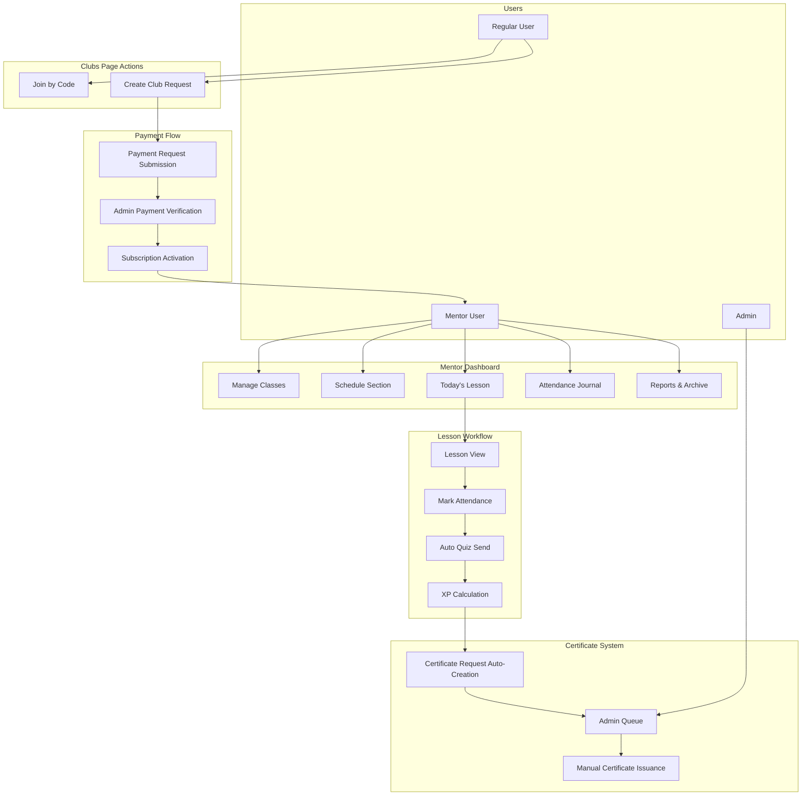

# Comprehensive Platform Enhancement: Kruzhok System & Error Handling

## Overview

This design document addresses two critical enhancement areas for the S7 Robotics Platform:
1. **Kruzhok (Clubs) Feature Expansion** - Transform clubs from admin-only to a full user-driven mentorship platform with subscriptions, class management, attendance tracking, and automated assessments
2. **Course Creation Error Resolution** - Fix critical bugs preventing course publication and improve error handling across the platform

## Part 1: Kruzhok Platform Enhancement

### Strategic Goals

| Goal ID | Feature Area | User Value | Technical Scope |
|---------|--------------|------------|-----------------|
| Goal 1 | Join & Create Club UI | Simplified club discovery and creation entry points | Frontend component redesign |
| Goal 2 | User Club Creation | Enable non-admin users to become mentors | Payment workflow + role elevation |
| Goal 3 | Subscription & Limits | Resource management and monetization | Database models + limit enforcement |
| Goal 4 | Modal Close Fixes | Consistent UX across dialogs | Frontend modal state management |
| Goal 5 | XP & Certificate System | Automated achievement recognition | Backend automation + admin workflow |
| Goal 6 | Schedule Separation | Organized mentor workflow | New schedule module extraction |
| Goal 7 | Today's Lesson View | Streamlined daily lesson delivery | Dashboard widget + detail page |
| Goal 8 | Attendance Journal | Student participation tracking | Interactive data grid component |
| Goal 9 | Auto Quiz Distribution | Automated assessment delivery | Event-driven quiz sending |
| Goal 10 | Admin Club Management | Centralized oversight | Admin panel enhancements |
| Goal 11 | Archive & Reports | Historical data and analytics | Data retention + export capabilities |

### Current State Analysis

**Existing Kruzhok Infrastructure:**
- Admin-only club creation via `/admin/kruzhok` route
- Access code-based enrollment system
- Basic member management with approval workflow
- Lesson template system with quizzes and matching games
- Enrollment status tracking (PENDING, APPROVED, REJECTED)

**Gaps Requiring Implementation:**
- No subscription/payment system for regular users
- No class subdivisions within clubs
- No attendance tracking mechanism
- Schedule management embedded in program templates
- No automated quiz distribution workflow
- No certificate generation process
- Limited reporting and archival capabilities

### Data Model Enhancements

#### New Database Entities

**Subscription Model:**

```
Table: Subscription
Fields:
- id: UUID (PK)
- userId: UUID (FK → User)
- type: ENUM('MONTHLY_SUBSCRIPTION', 'ONETIME_PURCHASE')
- status: ENUM('PENDING', 'ACTIVE', 'EXPIRED', 'REJECTED')
- amount: Decimal (default: 2000)
- currency: String (default: 'KZT')
- paymentMethod: String (default: 'KASPI')
- paymentComment: String (unique verification code)
- maxKruzhoks: Integer (default: 1)
- maxClassesPerKruzhok: Integer (default: 2)
- maxStudentsPerClass: Integer (default: 30)
- requestedAt: DateTime
- confirmedAt: DateTime (nullable)
- confirmedBy: UUID (FK → User, nullable)
- expiresAt: DateTime (nullable, for monthly subscriptions)
- adminNotes: Text (nullable)

Indexes:
- userId, status
- paymentComment (unique)
```

**ClubClass Model:**

```
Table: ClubClass
Fields:
- id: UUID (PK)
- kruzhokId: UUID (FK → Kruzhok)
- name: String (e.g., "Группа А", "Beginners")
- description: Text (nullable)
- maxStudents: Integer (default: 30)
- orderIndex: Integer
- isActive: Boolean (default: true)
- createdAt: DateTime
- createdBy: UUID (FK → User)

Indexes:
- kruzhokId, orderIndex (unique composite)
- kruzhokId, isActive
```

**Schedule Model:**

```
Table: Schedule
Fields:
- id: UUID (PK)
- kruzhokId: UUID (FK → Kruzhok)
- classId: UUID (FK → ClubClass, nullable - null means all classes)
- lessonTemplateId: UUID (FK → KruzhokLessonTemplate)
- title: String
- scheduledDate: Date
- scheduledTime: Time
- durationMinutes: Integer (default: 60)
- status: ENUM('SCHEDULED', 'IN_PROGRESS', 'COMPLETED', 'CANCELLED')
- completedAt: DateTime (nullable)
- createdBy: UUID (FK → User)
- createdAt: DateTime

Indexes:
- kruzhokId, scheduledDate
- scheduledDate, status
- createdBy
```

**Attendance Model:**

```
Table: Attendance
Fields:
- id: UUID (PK)
- scheduleId: UUID (FK → Schedule)
- studentId: UUID (FK → User)
- status: ENUM('PRESENT', 'LATE', 'ABSENT')
- notes: Text (nullable)
- markedAt: DateTime
- markedBy: UUID (FK → User - mentor)

Indexes:
- scheduleId, studentId (unique composite)
- studentId, markedAt
```

**CertificateRequest Model:**

```
Table: CertificateRequest
Fields:
- id: UUID (PK)
- userId: UUID (FK → User)
- kruzhokId: UUID (FK → Kruzhok)
- totalXP: Integer
- thresholdXP: Integer (default: 100)
- taskDescription: Text
- status: ENUM('PENDING', 'APPROVED', 'REJECTED', 'SENT')
- requestedAt: DateTime (auto-generated)
- reviewedAt: DateTime (nullable)
- reviewedBy: UUID (FK → User, nullable)
- sentAt: DateTime (nullable)
- certificateUrl: String (nullable)
- adminNotes: Text (nullable)

Indexes:
- userId, kruzhokId
- status, requestedAt
```

### System Architecture



### Feature Specifications

#### Goal 1: Join & Create Club Actions

**Clubs Page Layout Enhancement:**

Current `/dashboard?tab=clubs` displays only club listings. Enhancement adds two prominent action cards:

**"Join Club" Card:**
- Input field for access code (12-character alphanumeric)
- Submit button triggers `/api/kruzhok/enroll-by-code` endpoint
- On success: redirect to club detail page
- On error: display inline error message

**"Create Club" Card:**
- Button labeled "Открыть кружок"
- Displays subscription info: "Подписка: Xtg/месяц или разовая покупка 2000₸"
- Opens payment modal on click
- Shows locked state if user already has pending subscription request

**UI Specification:**

| Element | Component Type | Behavior |
|---------|---------------|----------|
| Join Club Input | Text input with validation | Min 6 chars, auto-uppercase, trim whitespace |
| Join Club Button | Primary CTA button | Disabled until valid code entered |
| Create Club Button | Secondary CTA button | Disabled if pending subscription exists |
| Subscription Info Text | Informational label | Updates based on user's current subscription status |

#### Goal 2: User Club Creation Workflow

**Payment Request Modal:**

Triggered when user clicks "Открыть кружок" without active subscription.

**Modal Content Structure:**

```
Title: "Создание кружка требует подписку"

Body:
"Для открытия кружка оплатите 2000₸. 
Переведите сумму на Kaspi: +7 776 045 7776
В комментарии укажите код: [UNIQUE_CODE]

После оплаты нажмите 'Отправить подтверждение'."

Payment Comment Code: [Generated UUID-based 8-char code, copyable]

Actions:
- [Copy Code] - Copies payment comment to clipboard
- [Отмена] - Closes modal
- [Отправить подтверждение] - Submits subscription request
```

**Backend Subscription Request Flow:**

```
POST /api/kruzhok/subscription/request
Request Body:
{
  type: "ONETIME_PURCHASE" | "MONTHLY_SUBSCRIPTION",
  amount: 2000,
  currency: "KZT",
  paymentComment: "ABC12XYZ"
}

Response Success (201):
{
  id: "subscription_uuid",
  status: "PENDING",
  message: "Запрос отправлен на проверку администратору"
}

Response Error (409 - Already Pending):
{
  error: "У вас уже есть активный запрос на подписку"
}
```

**Admin Payment Verification Panel:**

Located at `/admin/payments` (existing page enhancement).

**New Section: Club Subscription Requests**

Displays table with columns:
- User Name (fullName or email)
- User ID (for reference)
- Amount & Currency
- Payment Comment Code
- Request Date/Time
- Status
- Actions: [✅ Approve] [❌ Reject]

**Approval Action:**
```
POST /api/admin/kruzhok/subscription/:id/approve
Request Body:
{
  adminNotes: "Payment verified via Kaspi"
}

Side Effects:
1. Update subscription status to ACTIVE
2. Set confirmedAt timestamp
3. Create notification for user
4. Grant mentor-level permissions for Kruzhok features
```

**Rejection Action:**
```
POST /api/admin/kruzhok/subscription/:id/reject
Request Body:
{
  adminNotes: "Payment not found / incorrect amount"
}

Side Effects:
1. Update subscription status to REJECTED
2. Create notification: "Оплата не подтверждена. Свяжитесь с поддержкой."
```

#### Goal 3: Subscription Limits Enforcement

**Limit Validation Points:**

| Action | Validation | Error Response |
|--------|-----------|----------------|
| Create New Kruzhok | Check `countUserKruzhoks() < subscription.maxKruzhoks` | HTTP 403: "Достигнут лимит кружков (X/Y). Обновите подписку." |
| Create New Class | Check `countKruzhokClasses(kruzhokId) < subscription.maxClassesPerKruzhok` | HTTP 403: "Достигнут лимит классов (X/Y). Обновите подписку." |
| Add Student to Class | Check `countClassStudents(classId) < subscription.maxStudentsPerClass` | HTTP 403: "Достигнут лимит учеников (X/Y)." |

**Limit Upgrade Modal:**

Displayed when limit reached, offering upgrade options:

```
Title: "Лимит достигнут"
Body: "Вы достигли лимита [классов/учеников] по текущей подписке."

Options:
- Обновить подписку (+1000₸ за дополнительный класс)
- Связаться с поддержкой

Actions:
- [Оплатить обновление]
- [Отмена]
```

#### Goal 4: Modal Close Button Fixes

**Standardized Modal Component Behavior:**

All modals must implement consistent close behavior:

**State Management:**
- Clear all form inputs on close
- Reset validation errors
- Cancel any pending API requests
- Remove modal from route history (prevent back button confusion)

**Implementation Pattern:**

```
const handleModalClose = () => {
  // 1. Reset form state
  setFormData(initialState)
  setErrors({})
  
  // 2. Cancel pending requests
  abortController.current?.abort()
  
  // 3. Close modal
  setModalOpen(false)
  
  // 4. Optional: navigate back if modal changed route
  if (modalChangedRoute) {
    router.back()
  }
}
```

**Affected Modals:**
- Payment request modal
- Club creation wizard
- Lesson scheduling modal
- Attendance journal modal
- Certificate request modal

#### Goal 5: XP System & Certificate Workflow

**XP Accumulation:**

When student completes quiz in club lesson:

```
POST /api/kruzhok/:kruzhokId/lessons/:lessonId/quiz/submit
Request Body:
{
  answers: [{questionId, selectedIndex}]
}

Response includes:
{
  score: 85,
  totalQuestions: 10,
  correctAnswers: 9,
  xpAwarded: 20,
  userTotalXP: 105, // Updated total for this kruzhok
  thresholdReached: true, // If >= 100
  certificateRequestCreated: true
}
```

**Automatic Certificate Request Creation:**

When `userTotalXP` crosses 100 threshold:

```
Background Service Action:
1. Check if CertificateRequest already exists for user + kruzhok
2. If not exists, create:
   CertificateRequest {
     userId,
     kruzhokId,
     totalXP: 105,
     thresholdXP: 100,
     taskDescription: "Completed quiz on Lesson: [title]",
     status: 'PENDING',
     requestedAt: now()
   }
3. Create admin notification
```

**Admin Certificate Queue:**

Located at `/admin/kruzhok` in new "Certificates" tab.

**Table Columns:**
- Student Name
- Kruzhok Name
- Total XP
- Task Description
- Request Date
- Status
- Actions: [✅ Issue Certificate] [❌ Reject]

**Certificate Issuance Action:**

```
POST /api/admin/kruzhok/certificate/:id/issue
Request Body:
{
  certificateUrl: "/certificates/certificate_uuid.pdf" (generated)
}

Side Effects:
1. Update status to 'SENT'
2. Set sentAt timestamp
3. Create user notification: "Сертификат отправлен"
4. Optionally: send email with certificate attachment
```

#### Goal 6: Schedule Separation

**New Schedule Section:**

Extract scheduling from program templates into dedicated `/kruzhok/:id/schedule` route.

**Schedule View Components:**

| Component | Description | Functionality |
|-----------|-------------|---------------|
| Calendar View | Month calendar with lesson markers | Click date to view/add lessons |
| Today's Lessons Panel | Highlighted current day lessons | Quick access to active lessons |
| Upcoming Lessons List | Next 7 days chronological list | Edit/cancel scheduled lessons |
| Lesson History | Past lessons with completion status | View attendance and results |

**Schedule Creation Form:**

```
Form Fields:
- Lesson Template (dropdown from KruzhokLessonTemplate)
- Target Class (dropdown from ClubClass or "All Classes")
- Date (date picker)
- Time (time picker)
- Duration (number input, default 60 minutes)

Submit Action:
POST /api/kruzhok/:kruzhokId/schedule
```

#### Goal 7: Today's Lesson View

**Mentor Dashboard Enhancement:**

Add "Сегодняшний урок" widget at top of `/kruzhok/:id` page.

**Widget Display Logic:**

```
Query: SELECT * FROM Schedule 
       WHERE kruzhokId = :id 
       AND scheduledDate = CURRENT_DATE 
       AND status IN ('SCHEDULED', 'IN_PROGRESS')
       ORDER BY scheduledTime ASC
       LIMIT 1
```

**Widget Content:**

```
Card Display:
- Lesson Title
- Class Name (if specific class)
- Time: [scheduledTime] - [scheduledTime + duration]
- Status Badge
- [Начать урок] Button → navigates to lesson detail page
```

**Lesson Detail Page:**

Route: `/kruzhok/:id/lesson/:scheduleId`

**Page Sections:**

1. **Lesson Materials:**
   - Presentation link (if exists): [Скачать] [Просмотреть]
   - Scenario/plan text display

2. **Attendance Journal:**
   - Interactive student list with checkboxes
   - [Mark All Present] quick action
   - Individual status selectors: Present / Late / Absent

3. **Actions:**
   - [Сохранить посещаемость] → Updates attendance records
   - [Отправить квиз] → Triggers quiz distribution to present students
   - [Завершить урок] → Changes schedule status to COMPLETED

#### Goal 8: Attendance Journal

**Interactive Table Component:**

**Structure:**

```
Row Headers (Left Column): Student Names
Column Headers (Top Row): Lesson Dates/Titles
Cell Content: Status Selector (✓ Present / ⏰ Late / ❌ Absent)
Footer Row: Attendance Statistics per Student
```

**Data Model:**

```
GET /api/kruzhok/:kruzhokId/attendance
Query Params:
- classId (optional filter)
- fromDate (optional)
- toDate (optional)

Response:
{
  students: [
    {
      id: "user_uuid",
      name: "Student Name",
      attendanceRecords: [
        {scheduleId, lessonTitle, date, status}
      ],
      statistics: {
        totalLessons: 10,
        present: 8,
        late: 1,
        absent: 1,
        attendanceRate: 0.9
      }
    }
  ],
  lessons: [
    {id, title, date}
  ]
}
```

**Save Functionality:**

```
POST /api/kruzhok/:kruzhokId/attendance/bulk
Request Body:
{
  scheduleId: "schedule_uuid",
  attendances: [
    {studentId: "user_uuid", status: "PRESENT"},
    {studentId: "user_uuid_2", status: "LATE"}
  ]
}
```

#### Goal 9: Automated Quiz Distribution

**Trigger: After Attendance Marked**

When mentor saves attendance for a lesson, system automatically sends quiz to students marked as PRESENT.

**Implementation Flow:**

```
1. POST /api/kruzhok/:kruzhokId/schedule/:scheduleId/attendance
   Body: [{studentId, status}]

2. Backend processes:
   - Save attendance records
   - Query lesson template to get associated quiz
   - If quiz exists:
     - Create quiz assignments for each PRESENT student
     - Send notifications

3. Quiz Assignment Creation:
   Table: KruzhokQuizAssignment
   Fields:
   - id, kruzhokId, lessonTemplateId, userId
   - scheduleId (links to specific lesson occurrence)
   - status: 'ASSIGNED', 'IN_PROGRESS', 'COMPLETED'
   - assignedAt, completedAt
   - score (nullable until completed)

4. Student Notification:
   "Доступен новый квиз по уроку: [Lesson Title]"
   Links to: /kruzhok/:id/quiz/:assignmentId
```

#### Goal 10: Admin Panel Enhancements

**New Admin Routes:**

| Route | Purpose | Components |
|-------|---------|------------|
| `/admin/kruzhok/programs` | Manage lesson templates | CRUD for KruzhokLessonTemplate |
| `/admin/kruzhok/materials` | Upload presentations/scenarios | File upload + association |
| `/admin/kruzhok/payments` | Subscription verification queue | Approve/reject subscription requests |
| `/admin/kruzhok/certificates` | Certificate issuance queue | Review XP achievements, issue certificates |

**Program Management Features:**

- Create/edit lesson templates
- Upload associated files (presentations, scenarios)
- Create quiz questions for lessons
- Assign materials to specific programs

#### Goal 11: Archive & Reports

**Archive Data Structure:**

```
GET /api/kruzhok/:kruzhokId/archive
Query Params:
- fromDate, toDate
- classId (filter)
- lessonTemplateId (filter)

Response:
{
  lessons: [
    {
      scheduleId,
      lessonTitle,
      date,
      time,
      className,
      attendance: {present: 15, late: 2, absent: 3},
      quizResults: {avgScore: 82, submissions: 17},
      materials: [{type: 'presentation', url}, {type: 'scenario', url}]
    }
  ],
  summary: {
    totalLessons: 25,
    avgAttendance: 0.85,
    avgQuizScore: 78
  }
}
```

**Export Functionality:**

```
POST /api/kruzhok/:kruzhokId/archive/export
Request Body:
{
  format: "CSV" | "PDF",
  filters: {fromDate, toDate, classId}
}

Response:
{
  downloadUrl: "/exports/kruzhok_archive_uuid.csv"
}
```

**CSV Export Columns:**
- Lesson Date, Lesson Title, Class Name, Total Students
- Present Count, Late Count, Absent Count, Attendance Rate
- Quiz Average Score, Quiz Submission Rate

**PDF Export Sections:**
- Cover page with kruzhok info
- Summary statistics with charts
- Detailed lesson-by-lesson breakdown
- Student participation table

---

## Part 2: Course Creation Error Handling

### Problem Analysis

**Error Patterns Identified:**

1. **404 Error on `/api/admin-courses/courses/{courseId}/basic`**
   - Frontend calls `/courses/:courseId/basic` route
   - Backend route may be misregistered or courseId is invalid

2. **400 Error on Lesson Save with `[object Object]` message**
   - Validation errors not properly serialized
   - Frontend displays raw object instead of error message

3. **500 Error on `/api/admin-courses/{courseId}?sync=ids`**
   - Database constraint violation or transaction failure
   - Likely P2002 (unique constraint) or P2025 (record not found)

### Root Cause Resolution

#### Issue 1: 404 Route Mismatch

**Backend Route Registration Verification:**

Ensure `/server/src/index.ts` correctly mounts admin-courses router:

```
Expected Configuration:
app.use("/api/admin-courses", adminCoursesRouter)

Router Definition in admin-courses.ts must include:
POST /:courseId/basic
```

**If Route Missing:**

Add route to `/server/src/routes/admin-courses.ts`:

```
Route Specification:
POST /:courseId/basic

Handler Logic:
1. If courseId === "new": create new course
2. Else: update existing course with courseId
3. Validate request body against basicCourseSchema
4. Return course object or validation errors
```

#### Issue 2: Validation Error Display

**Backend Error Response Format:**

When Zod validation fails, format errors for frontend consumption:

```
Current Problematic Response:
{
  error: {fieldErrors: {...}, formErrors: [...]}
}

Improved Response:
{
  error: "Validation failed",
  code: "VALIDATION_ERROR",
  fields: {
    title: ["Title is required"],
    difficulty: ["Difficulty must be one of: Beginner, Intermediate, Advanced"]
  }
}
```

**Frontend Error Handling:**

Update API client in `/lib/api.ts`:

```
Enhancement to apiFetch():

if (!res.ok) {
  const text = await res.text()
  let errorMessage = text
  
  try {
    const errorData = JSON.parse(text)
    
    // Handle validation errors
    if (errorData.fields) {
      const fieldMessages = Object.entries(errorData.fields)
        .map(([field, messages]) => `${field}: ${messages.join(', ')}`)
        .join('; ')
      errorMessage = fieldMessages
    } else {
      errorMessage = errorData.error || errorData.message || text
    }
  } catch {}
  
  throw new Error(errorMessage)
}
```

#### Issue 3: 500 Sync Errors

**Database Transaction Safety:**

Wrap course sync operations in transactions with rollback:

```
Transaction Pattern:

await prisma.$transaction(async (tx) => {
  // 1. Update course basic info
  const course = await tx.course.update({
    where: {id: courseId},
    data: {title, description, difficulty}
  })
  
  // 2. Sync modules
  for (const module of modules) {
    if (module.id) {
      // Update existing
      await tx.courseModule.update({
        where: {id: module.id},
        data: {title, orderIndex}
      }).catch(async (error) => {
        // P2025: Module not found, create new
        if (error.code === 'P2025') {
          return tx.courseModule.create({
            data: {courseId, title, orderIndex}
          })
        }
        throw error
      })
    } else {
      // Create new module
      await tx.courseModule.create({
        data: {courseId, title, orderIndex}
      })
    }
    
    // 3. Sync lessons similarly
  }
}, {timeout: 30000})
```

**P2002 Unique Constraint Handling:**

When orderIndex conflicts occur:

```
Conflict Resolution Strategy:

try {
  await prisma.lesson.create({
    data: {moduleId, title, orderIndex}
  })
} catch (error) {
  if (error.code === 'P2002' && error.meta?.target?.includes('orderIndex')) {
    // Find existing lesson at this orderIndex
    const existing = await prisma.lesson.findFirst({
      where: {moduleId, orderIndex}
    })
    
    if (existing) {
      // Update existing instead of creating
      return prisma.lesson.update({
        where: {id: existing.id},
        data: {title, content, videoUrl}
      })
    }
  }
  throw error
}
```

### Enhanced Error Logging

**Backend Structured Logging:**

Add detailed error context for debugging:

```
Logging Pattern:

try {
  // Operation
} catch (error) {
  console.error('Course sync failed:', {
    courseId,
    userId: req.user.id,
    operation: 'sync_modules',
    error: error.message,
    stack: error.stack,
    prismaCode: error.code,
    timestamp: new Date().toISOString()
  })
  
  return res.status(500).json({
    error: 'Failed to sync course',
    code: 'COURSE_SYNC_ERROR',
    requestId: req.id // Add request ID tracking
  })
}
```

**Frontend Error Telemetry:**

Log errors to backend for monitoring:

```
POST /api/errors/log
Request Body:
{
  level: 'error',
  message: 'Course save failed',
  context: {
    route: '/admin/courses/new',
    courseId,
    errorType: '500_SERVER_ERROR',
    userAgent: navigator.userAgent
  },
  timestamp: Date.now()
}
```

### Error Prevention Measures

**Frontend Validation Before API Calls:**

```
Validation Checklist:

Before submitting course:
1. Title is non-empty (min 3 chars)
2. Description is non-empty
3. Difficulty is selected from allowed values
4. At least one module exists
5. Each module has at least one lesson
6. All media files have valid URLs (not IndexedDB references)

Display validation errors inline before API call
```

**Backend Pre-flight Checks:**

```
Before Course Update:

1. Verify courseId exists and user has permission
2. Validate all moduleIds exist if provided
3. Validate all lessonIds exist if provided
4. Check for orderIndex conflicts
5. Verify media URLs are accessible
6. Validate required fields are present

Return 400 with specific error if any check fails
```

### Testing Strategy

**Error Scenario Test Cases:**

| Scenario | Expected Behavior | Success Criteria |
|----------|-------------------|------------------|
| Create course without title | 400 error with field-level message | Error message displayed under title field |
| Update non-existent course | 404 error with clear message | "Course not found" toast notification |
| Duplicate orderIndex | Auto-resolution or 409 with guidance | Course saves successfully or clear conflict message |
| Network timeout during sync | Retry with exponential backoff | Course eventually saves or clear timeout message |
| Invalid courseId format | 400 error | "Invalid course ID format" message |

**Success Metrics:**

- Course creation success rate: >95%
- Average error resolution time: <2 minutes
- User-reported "not available" errors: 0
- Validation error clarity rating: >4/5 from admin users

### Rollback Plan

If error handling changes introduce regressions:

1. **Backend Route Rollback:** Restore previous route definitions via git revert
2. **Frontend Error Handling:** Feature flag to disable new error formatting
3. **Database Transactions:** Disable transaction wrapping, use individual operations
4. **Logging:** Reduce logging verbosity to prevent performance impact

### Monitoring & Alerts

**Key Metrics to Track:**

- Course creation error rate (target: <5%)
- 404 error count on admin-courses routes (target: 0)
- 500 error count on sync operations (target: <1%)
- Average course creation time (target: <30 seconds)
- Validation error distribution by field

**Alert Triggers:**

- Error rate spikes above 10% in 5-minute window
- More than 5 consecutive 500 errors on same endpoint
- Course creation taking longer than 60 seconds
