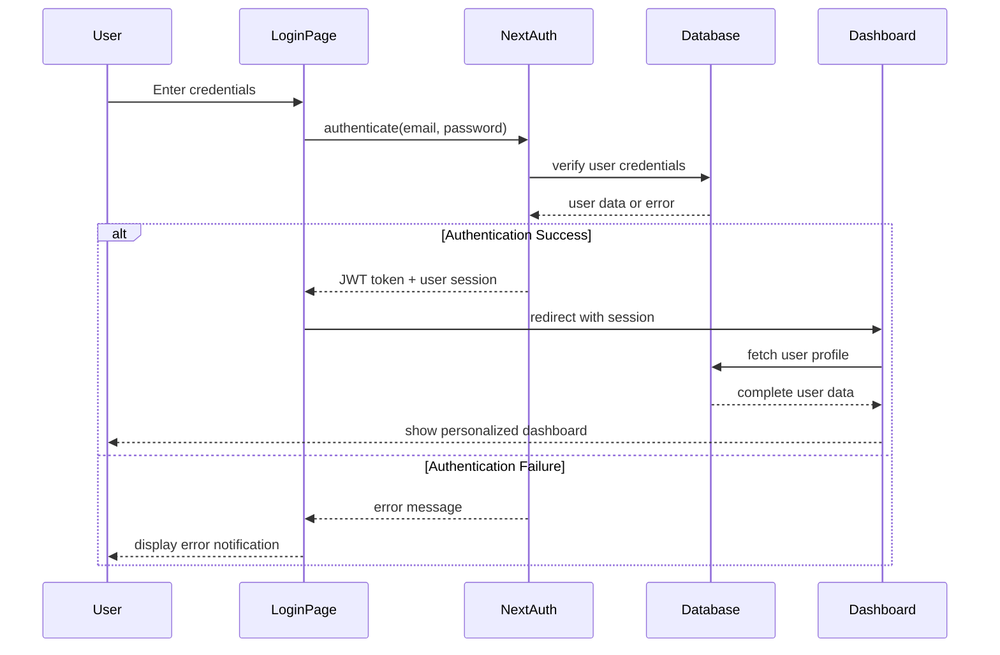

# S7 Robotics Platform Enhancement Design

## Overview

The S7 Robotics platform is a comprehensive learning management system built with Next.js 14, designed to provide educational content, team management, and achievement tracking for robotics and programming students. This enhancement expands the platform to include full user management, payment system integration, advanced authentication, and a comprehensive admin panel for content and user management.

### Current Architecture Analysis
- **Frontend**: Next.js 14 App Router with TypeScript 5, Tailwind CSS 4
- **Database**: Currently uses empty Prisma schema with SQLite dev.db 
- **Authentication**: Basic hardcoded authentication (email: "1", password: "1")
- **Admin Panel**: Static components with localStorage-based admin access
- **State Management**: React state with local component management

### Enhancement Goals
1. Implement persistent user authentication and profile management
2. Create comprehensive database schema for all platform entities
3. Build functional payment system with Kaspi integration
4. Enable full admin panel functionality for user and content management
5. Implement achievement system and course purchase workflow

## Technology Stack & Dependencies

| Component | Current | Enhanced |
|-----------|---------|----------|
| Database ORM | Prisma 6.16.1 | Maintained |
| Authentication | Hardcoded | NextAuth.js 4.24.11 + Custom JWT |
| Database Engine | SQLite (dev.db) | PostgreSQL for production, SQLite for development |
| Payment Integration | None | Kaspi Pay API integration |
| Email Service | None | Nodemailer + SMTP service |  
| File Storage | Local | AWS S3 or Cloudinary for course media |
| Real-time Features | None | WebSocket support for notifications |

## Architecture

The enhanced platform follows a layered architecture pattern optimized for scalability and maintainability:

## Data Models & Database Schema

### Core Entity Relationships

### Database Schema Configuration

| Entity | Primary Storage | Indexes | Constraints |
|--------|----------------|---------|-------------|
| User | PostgreSQL | email (unique), created_at | email format validation |
| UserProfile | PostgreSQL | user_id (unique) | FK to User |
| Course | PostgreSQL | author_id, difficulty_level, created_at | price >= 0 |
| CourseModule | PostgreSQL | course_id, order_index | order_index unique per course |
| Lesson | PostgreSQL | module_id, order_index | order_index unique per module |
| UserCourseEnrollment | PostgreSQL | user_id, course_id (composite unique) | status enum validation |
| Purchase | PostgreSQL | user_id, course_id, created_at | amount > 0 |
| Achievement | PostgreSQL | criteria_type, created_at | criteria_data JSON validation |
| Team | PostgreSQL | captain_id, created_at | max_members >= 1 |
| Notification | PostgreSQL | user_id, created_at, is_read | automatic expiry after 30 days |

## Authentication & Authorization System

### Authentication Flow Architecture

### Session Management Strategy

| Feature | Implementation | Duration | Storage |
|---------|---------------|----------|---------|
| JWT Tokens | NextAuth.js custom provider | 7 days | httpOnly cookies |
| Session Refresh | Automatic on API calls | 24 hours | Server-side validation |
| Remember Me | Extended JWT expiry | 30 days | Secure localStorage flag |
| Admin Sessions | Elevated permission tokens | 2 hours | Separate cookie domain |
| Password Reset | Temporary signed tokens | 15 minutes | Database temporary table |

### User Registration & Profile Setup

### Authorization Levels

| Role | Permissions | Access Areas |
|------|------------|--------------|
| Guest | View public content | Landing page, course previews |
| Registered User | View purchased courses, manage profile | Dashboard, purchased content |
| Team Captain | Manage team members, team profile | Team management section |
| Admin | Full platform management | Admin panel, all user data |
| Super Admin | System configuration, admin management | Full system access |

## Course Purchase & Payment System

### Payment Flow Architecture

### Payment Integration Specifications

| Component | Implementation | Configuration |
|-----------|---------------|---------------|
| Kaspi Pay Integration | Manual verification process | Business Kaspi wallet number |
| Payment Statuses | pending → sent → confirmed → completed | Database enum type |
| Payment Confirmation | Admin manual verification | 2-hour SLA for confirmation |
| Course Access | Immediate upon admin confirmation | Automatic enrollment creation |
| Payment Records | Full audit trail maintained | 7-year retention policy |

### Purchase Workflow States

## Admin Panel Functionality

### Admin Dashboard Architecture

### Admin Panel Features Specification

| Feature | Description | Functionality |
|---------|-------------|---------------|
| User Registry | Complete user database view | Search, filter, edit profiles, view purchase history |
| Achievement System | Award management interface | Create custom achievements, bulk award, track user progress |
| Course Assignment | Direct course enrollment | Bypass payment for promotional access |
| Payment Verification | Kaspi payment confirmation | View payment screenshots, confirm/reject, add notes |
| Analytics Dashboard | Platform usage statistics | User growth, course popularity, revenue tracking |
| Team Management | Team creation and oversight | Approve team formations, manage competitions |
| Content Moderation | Review user-generated content | Approve team profiles, competition results |

### Admin Workflow: Achievement Award Process

## Achievement System

### Achievement Categories & Criteria

| Category | Achievement Types | Criteria | Points Awarded |
|----------|------------------|----------|----------------|
| Learning | Course Completion | Complete any paid course | 500 XP |
| Learning | Perfect Score | Score 100% on course quiz | 200 XP |
| Learning | Learning Streak | Complete lessons 7 days in a row | 300 XP |
| Competition | First Competition | Participate in first competition | 400 XP |
| Competition | Award Winner | Win any competition award | 800 XP |
| Competition | Team Captain | Lead a team for 6 months | 600 XP |
| Social | Referral | Refer 5 new users who complete registration | 1000 XP |
| Social | Community Helper | Help other users in forums | 100 XP per help |
| Platform | Early Adopter | Register in first 1000 users | 1500 XP |
| Custom | Admin Awarded | Manually awarded by administrators | Variable |

### Level Progression System

### Achievement Notification System

## Team Management System

### Team Formation & Management

| Feature | Description | Implementation |
|---------|-------------|---------------|
| Team Creation | Users can create teams | Captain role automatically assigned to creator |
| Member Invitation | Captains invite users via email/username | Invitation system with accept/decline |
| Role Management | Captain, Co-Captain, Member roles | Different permission levels per role |
| Team Profile | Public team information page | Logo, description, member list, achievements |
| Competition Registration | Teams register for competitions | Admin approval required |
| Team Statistics | Performance tracking | Win/loss records, member progress |

### Team Roles & Permissions

| Role | Permissions | Limitations |
|------|-------------|-------------|
| Captain | Invite/remove members, edit team profile, register for competitions | Cannot remove self, must transfer captaincy |
| Co-Captain | Invite members, edit team profile | Cannot remove captain or other co-captains |
| Member | View team information, participate in team activities | Cannot modify team settings |

## API Endpoints Reference

### Authentication Endpoints

| Endpoint | Method | Description | Request Body | Response |
|----------|--------|-------------|--------------|----------|
| `/api/auth/login` | POST | User login | `{email, password}` | `{user, token, expires}` |
| `/api/auth/register` | POST | User registration | `{email, password, fullName}` | `{success, userId}` |
| `/api/auth/verify-email` | GET | Email verification | `?token=xxx` | `{success, message}` |
| `/api/auth/reset-password` | POST | Password reset request | `{email}` | `{success, message}` |
| `/api/auth/logout` | POST | User logout | `{}` | `{success}` |

### User Management Endpoints

| Endpoint | Method | Description | Request Body | Response |
|----------|--------|-------------|--------------|----------|
| `/api/users/profile` | GET | Get user profile | N/A | `{user, profile, achievements}` |
| `/api/users/profile` | PUT | Update user profile | `{fullName, age, institution, role}` | `{success, user}` |
| `/api/users/achievements` | GET | Get user achievements | N/A | `{achievements, totalXP, level}` |
| `/api/users/courses` | GET | Get enrolled courses | N/A | `{courses, progress}` |
| `/api/users/teams` | GET | Get user teams | N/A | `{teams, role}` |

### Course Management Endpoints

| Endpoint | Method | Description | Request Body | Response |
|----------|--------|-------------|--------------|----------|
| `/api/courses` | GET | List all courses | `?search=&difficulty=&page=` | `{courses, pagination}` |
| `/api/courses/:id` | GET | Get course details | N/A | `{course, modules, lessons}` |
| `/api/courses/:id/enroll` | POST | Enroll in free course | `{}` | `{success, enrollment}` |
| `/api/courses/:id/purchase` | POST | Purchase course | `{}` | `{purchaseId, paymentDetails}` |
| `/api/courses/:id/progress` | GET | Get course progress | N/A | `{progress, completedLessons}` |
| `/api/courses/:id/lessons/:lessonId/complete` | POST | Mark lesson complete | `{}` | `{success, newProgress}` |

### Payment Endpoints

| Endpoint | Method | Description | Request Body | Response |
|----------|--------|-------------|--------------|----------|
| `/api/payments/:id/confirm-sent` | POST | User confirms payment sent | `{}` | `{success, status}` |
| `/api/payments/history` | GET | User payment history | N/A | `{payments, pagination}` |

### Admin Endpoints

| Endpoint | Method | Description | Request Body | Response |
|----------|--------|-------------|--------------|----------|
| `/api/admin/users` | GET | List all users | `?search=&page=` | `{users, pagination}` |
| `/api/admin/users/:id` | PUT | Update user | `{profile, achievements}` | `{success, user}` |
| `/api/admin/users/:id/achievements` | POST | Award achievement | `{achievementId, note}` | `{success, achievement}` |
| `/api/admin/payments/pending` | GET | Pending payments | N/A | `{payments, count}` |
| `/api/admin/payments/:id/verify` | POST | Verify payment | `{status, notes}` | `{success, payment}` |
| `/api/admin/courses` | POST | Create course | `{title, description, price}` | `{success, courseId}` |
| `/api/admin/courses/:id` | PUT | Update course | `{course data}` | `{success, course}` |
| `/api/admin/achievements` | POST | Create achievement | `{title, description, criteria}` | `{success, achievementId}` |

### Team Management Endpoints

| Endpoint | Method | Description | Request Body | Response |
|----------|--------|-------------|--------------|----------|
| `/api/teams` | POST | Create team | `{name, description}` | `{success, teamId}` |
| `/api/teams/:id` | GET | Get team details | N/A | `{team, members, competitions}` |
| `/api/teams/:id/invite` | POST | Invite member | `{userId}` | `{success, invitation}` |
| `/api/teams/:id/members/:userId` | DELETE | Remove member | N/A | `{success}` |
| `/api/teams/:id/competitions` | POST | Add competition | `{name, date, awards}` | `{success, competitionId}` |

## Middleware & Interceptors

### Authentication Middleware
Protects routes requiring user authentication and provides user context to API handlers.

### Admin Authorization Middleware
Verifies admin privileges for admin panel endpoints.

| Check | Implementation | Fallback |
|-------|---------------|----------|
| User authentication | JWT token validation | Redirect to login |
| Admin role verification | User.is_admin === true | Return 403 Forbidden |
| Session freshness | Admin session < 2 hours | Re-authenticate |
| Action logging | Log all admin actions | System audit trail |

### Rate Limiting Middleware
Prevents abuse and ensures fair resource usage.

| Endpoint Type | Rate Limit | Window | Implementation |
|---------------|------------|--------|-----------------|
| Authentication | 5 attempts | 15 minutes | IP-based limiting |
| API calls | 100 requests | 1 minute | User-based limiting |
| File uploads | 10 uploads | 1 hour | User + file size limiting |
| Payment confirmations | 3 attempts | 5 minutes | User-based limiting |

## Business Logic Layer

### User Service Architecture
Centralized user management with comprehensive profile and achievement handling.

| Function | Description | Dependencies |
|----------|-------------|--------------|
| `createUser(userData)` | Create new user account with profile | Database, Email Service |
| `authenticateUser(email, password)` | Validate credentials and return session | Database, JWT Service |
| `updateProfile(userId, profileData)` | Update user profile information | Database, Validation Service |
| `calculateLevel(userId)` | Calculate user level based on XP | Database, Achievement Service |
| `awardAchievement(userId, achievementId)` | Award achievement and calculate XP | Database, Notification Service |

### Course Service Architecture
Manages course content, enrollment, and progress tracking.

| Function | Description | Dependencies |
|----------|-------------|--------------|
| `getCourseWithProgress(courseId, userId)` | Get course details with user progress | Database |
| `enrollUser(userId, courseId)` | Enroll user in course | Database, Notification Service |
| `updateLessonProgress(userId, lessonId)` | Track lesson completion | Database, Achievement Service |
| `calculateCourseProgress(userId, courseId)` | Calculate completion percentage | Database |
| `checkCourseAccess(userId, courseId)` | Verify user has access to course | Database, Payment Service |

### Payment Service Architecture
Handles course purchases and payment verification workflow.

### Achievement Service Architecture
Automates achievement detection and award distribution.

| Trigger Event | Achievements Checked | Auto-Award Criteria |
|---------------|---------------------|---------------------|
| Course completion | Learning achievements | Course finished + quiz passed |
| Lesson completion | Streak achievements | Daily lesson completion |
| Competition entry | Competition achievements | First competition participation |
| Team creation | Leadership achievements | Team captaincy role |
| User referral | Social achievements | Referred user completes profile |
| Admin action | Custom achievements | Manual admin award |

## State Management

### Client-Side State Architecture
Optimized state management for responsive user experience.

### Global State Management

| State Slice | Managed Data | Update Triggers |
|-------------|--------------|----------------|
| Authentication | User session, tokens, permissions | Login, logout, token refresh |
| User Profile | Personal info, achievements, level | Profile updates, XP changes |
| Course Progress | Enrolled courses, lesson progress | Lesson completion, enrollment |
| Notifications | System messages, achievements | Real-time events, admin actions |
| Admin Panel | User lists, payment queue, analytics | Admin actions, periodic refresh |

### Local Storage Strategy

| Data Type | Storage Method | Persistence Duration | Purpose |
|-----------|----------------|---------------------|----------|
| User preferences | localStorage | Permanent | Theme, language, settings |
| Session tokens | httpOnly cookies | 7 days | Authentication |
| Course progress cache | sessionStorage | Browser session | Performance optimization |
| Admin credentials | Secure localStorage | 2 hours | Admin panel access |

## Testing Strategy

### Unit Testing Framework
Comprehensive testing coverage for business logic and utility functions.

| Component | Testing Framework | Coverage Target | Test Types |
|-----------|------------------|-----------------|------------|
| API Routes | Jest + Supertest | 90%+ | Integration, error handling |
| Database Models | Jest + Prisma Test Environment | 95%+ | CRUD operations, relationships |
| Authentication | Jest + Mock JWT | 100% | Token validation, session management |
| Payment Logic | Jest + Mock APIs | 95%+ | Payment flow, status transitions |
| Achievement System | Jest + Test Database | 90%+ | Criteria evaluation, XP calculation |

### Integration Testing
End-to-end testing of critical user workflows.

### Test Data Management

| Test Environment | Database | User Accounts | Course Content |
|------------------|----------|---------------|----------------|
| Development | SQLite with seed data | 10 test users | 5 sample courses |
| Testing | In-memory database | Generated per test | Mock course data |
| Staging | PostgreSQL replica | Production-like data | Sanitized content |

## Security Considerations

### Data Protection Measures

| Security Layer | Implementation | Protection Level |
|----------------|---------------|------------------|
| Password Security | bcrypt hashing with salt rounds = 12 | High |
| JWT Security | RS256 algorithm with rotation | High |
| Database Security | Parameterized queries, input validation | High |
| Admin Access | Multi-factor authentication | Critical |
| Payment Data | PCI-DSS compliance, encrypted storage | Critical |
| File Uploads | Virus scanning, type validation | Medium |

### API Security Implementation

| Vulnerability | Mitigation Strategy | Implementation |
|---------------|-------------------|----------------|
| SQL Injection | Prisma ORM with parameterized queries | Automated |
| XSS Attacks | Input sanitization, CSP headers | Manual validation |
| CSRF Attacks | CSRF tokens, SameSite cookies | NextAuth.js built-in |
| Rate Limiting | IP and user-based throttling | Custom middleware |
| Data Validation | Zod schema validation | API route level |

### Privacy & GDPR Compliance

| Data Type | Collection Basis | Retention Period | User Rights |
|-----------|-----------------|------------------|-------------|
| Personal Information | User consent | Account lifetime | Access, rectification, deletion |
| Course Progress | Legitimate interest | 2 years post-completion | Access, portability |
| Payment Records | Legal obligation | 7 years | Access only |
| Achievement Data | User consent | Account lifetime | Access, deletion |
| Analytics Data | Anonymous aggregation | 2 years | N/A |