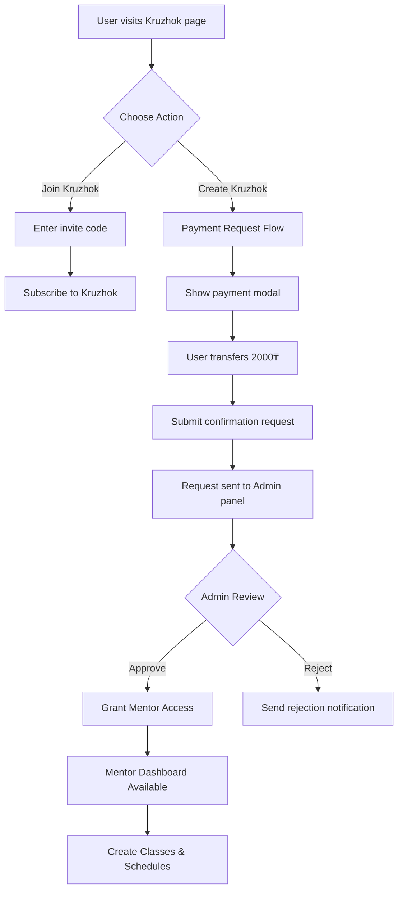

# Enhanced Kruzhok System & Course Publishing Error Fixes

## Overview

This design addresses two critical areas:
1. **Course Publishing Errors**: Fixing API routing issues causing 404 and 400 errors during course creation and publishing
2. **Enhanced Kruzhok System**: Implementing a comprehensive kruzhok (club) management system with mentor capabilities, subscriptions, attendance tracking, and certificate management

---

## Problem Analysis

### Course Publishing Issues

Based on error logs, the following issues have been identified:

| Error | Endpoint | Status | Root Cause |
|-------|----------|--------|------------|
| Basic info save failure | `/api/admin-courses/courses/[id]/basic` | 404 | Route expects `/:courseId/basic` but frontend calls `/courses/:courseId/basic` |
| Lesson save failure | `/api/admin-courses/lessons/[id]` | 400 | Validation errors not properly formatted for frontend display |
| Course publishing failure | `/api/admin-courses/courses/[id]/basic` | 404 | Same routing mismatch as basic info |
| Sync endpoint failure | `/api/admin-courses/[id]?sync=ids` | 500 | Potential transaction or constraint violation errors |

**Core Issue**: Path mismatch between frontend calling `/api/admin-courses/courses/{id}/...` and backend expecting `/api/admin-courses/{id}/...`

### Kruzhok System Requirements

The system must support:
- User-initiated kruzhok creation with payment approval workflow
- Subscription-based access with limits (classes, students)
- Mentor dashboard for class management
- Attendance tracking (tabular journal)
- Quiz delivery after attendance marking
- XP-based certificate request system
- Separate scheduling section
- Archive system for lessons and reports

---

## Solution Design

## Part 1: Course Publishing Error Fixes

### 1.1 API Route Corrections

**Objective**: Align backend routes with frontend expectations and improve error messaging

#### Route Structure Standardization

The backend admin-courses router should support both patterns for backward compatibility:

| Frontend Call | Backend Route | Method | Purpose |
|---------------|---------------|--------|---------|
| `/api/admin-courses/:courseId` | `/:courseId` | GET | Get course with modules/lessons |
| `/api/admin-courses/courses/:courseId/basic` | `/:courseId/basic` OR `/courses/:courseId/basic` | POST | Create/update basic info |
| `/api/admin-courses/:courseId` | `/:courseId` | PUT | Update full course structure |
| `/api/admin-courses/courses/:courseId/modules` | `/courses/:courseId/modules` | POST | Create module |
| `/api/admin-courses/modules/:moduleId` | `/modules/:moduleId` | PUT | Update module |
| `/api/admin-courses/modules/:moduleId/lessons` | `/modules/:moduleId/lessons` | POST | Create lesson |
| `/api/admin-courses/lessons/:lessonId` | `/lessons/:lessonId` | PUT | Update lesson |

#### Enhanced Error Response Format

All validation errors must follow the standardized format from memory:

```
{
  "error": "Human-readable primary error message",
  "code": "MACHINE_READABLE_CODE",
  "fields": {
    "fieldName": ["error message 1", "error message 2"]
  },
  "message": "Combined error text from all fields"
}
```

#### Validation Error Handling Strategy

**For Lesson Updates**:
- When validation fails, extract field-level errors from Zod
- Format them into the `fields` object
- Generate a combined `message` string joining all field errors
- Return status 400 with complete error object

**For Course Basic Info**:
- Same pattern as lesson updates
- Handle special case when `courseId === "new"` for creation vs update
- Preserve Prisma error codes (P2025 for not found → 404)

### 1.2 Frontend Error Display Improvements

**Objective**: Parse structured errors and show user-friendly messages

#### Error Parsing Logic

When API returns error response:
1. Check if `error.fields` exists (validation error)
2. If yes, display each field error near the corresponding input
3. Show `error.message` as toast notification
4. If no `fields`, show `error.error` or generic message

#### Close Button Behavior

**Modal Close Actions**:
- Clear all form state
- Reset validation errors
- If unsaved changes exist, show confirmation dialog
- Return to previous route using browser history or explicit redirect
- Remove any temporary IDs or draft states

---

## Part 2: Enhanced Kruzhok System

### 2.1 System Architecture

#### User Journey Flow



### 2.2 Subscription & Payment System

#### Subscription Types

| Type | Price | Duration | Limits |
|------|-------|----------|--------|
| One-time Purchase | 2000₸ | Lifetime | 2 classes, 30 students |
| Monthly Subscription | X₸ | 30 days | 2 classes, 30 students |
| Upgrade Package | Variable | N/A | Additional classes/students |

#### Payment Request Workflow

**Step 1: User Initiates Kruzhok Creation**
- User clicks "Открыть кружок" button
- System checks if user already has active subscription
- If yes, redirect to mentor dashboard
- If no, show payment modal

**Step 2: Payment Modal Display**

Modal Content:
- Title: "Создание кружка"
- Message: "Для открытия кружка оплатите 2000₸. Переведите сумму на указанный номер. После оплаты нажмите 'Отправить запрос'."
- Payment details: Bank number, recipient name
- Input field: Payment comment (unique identifier)
- File upload: Optional payment proof screenshot
- Buttons: "Отправить подтверждение", "Отмена"

**Step 3: Request Submission**

Data captured:
- User ID
- Full name
- Email
- Subscription type (default: ONETIME_PURCHASE)
- Amount: 2000
- Payment comment (unique)
- Payment method: KASPI
- Timestamp
- Optional: Uploaded payment proof

**Step 4: Admin Panel Review**

Admin sees table with pending requests:

| User | Email | Amount | Comment | Date | Proof | Actions |
|------|-------|--------|---------|------|-------|---------|
| Full Name | email@example.com | 2000₸ | unique-code | 2025-01-10 | [View] | ✅ Approve / ❌ Reject |

Admin actions:
- **Approve**: 
  - Set subscription status to ACTIVE
  - Set `confirmedAt` timestamp
  - Set `confirmedBy` to admin user ID
  - Create notification for user
  - Grant mentor role capabilities
- **Reject**:
  - Set status to REJECTED
  - Add admin notes (rejection reason)
  - Send notification to user

### 2.3 Kruzhok Structure

#### Data Hierarchy

```
Kruzhok (Club)
├── Basic Info (name, description, owner, program)
├── Subscription (owner's subscription status)
├── Classes (up to limit)
│   ├── Class 1
│   │   ├── Students (up to 30)
│   │   ├── Schedules
│   │   └── Attendance Records
│   └── Class 2
├── Schedules (separate section)
│   ├── Today's Lesson
│   ├── Upcoming Lessons
│   └── Lesson Archive
└── Certificate Requests
```

### 2.4 Mentor Dashboard Sections

#### Section 1: Classes Management

**Purpose**: Create and manage classes within kruzhok

**Features**:
- View all classes in kruzhok
- Create new class (if under limit)
- Edit class details (name, description, max students)
- Generate invite code for class
- View enrolled students list
- Add/remove students manually
- Deactivate class

**Limit Enforcement**:
- Check subscription `maxClassesPerKruzhok` before allowing creation
- Display current usage: "Classes: 1/2"
- If limit reached, show upgrade prompt modal

#### Section 2: Schedule Section (NEW - Separate from Programs)

**Purpose**: Manage lesson schedules independently

**Features**:
- Calendar view with scheduled lessons
- "Today's Lesson" prominent card at top
- Create new schedule entry
- Link schedule to lesson template from program
- Set date, time, duration
- Associate with specific class
- Status tracking: SCHEDULED, IN_PROGRESS, COMPLETED, CANCELLED

**Today's Lesson Card**:
- Displays if lesson scheduled for current date
- Shows: Lesson title, class name, time, status
- Quick actions:
  - View lesson materials (presentation, script)
  - Mark attendance
  - Start lesson (change status to IN_PROGRESS)

**Lesson Materials Access**:
When clicking on scheduled lesson:
- Display lesson template details
- Download/view presentation (if available)
- Download/view script (if available)
- View quiz questions (if assigned)
- Access to attendance marking

#### Section 3: Attendance Journal (Tabular)

**Purpose**: Track student attendance in table format

**Table Structure**:

| Student Name | Date 1 | Date 2 | Date 3 | ... | Total | % |
|--------------|--------|--------|--------|-----|-------|---|
| Student A | ✓ | ⏰ | ✓ | ... | 2/3 | 67% |
| Student B | ❌ | ✓ | ✓ | ... | 2/3 | 67% |
| Add Student | | | | | | |

**Features**:
- Left column: Student names (sortable, searchable)
- Top row: Dates/events (dynamically added)
- Cells: Status selection (Present ✓ / Late ⏰ / Absent ❌)
- Add student button (manual entry by full name)
- Add date/event column button
- Save button (persists all changes)
- Export to CSV/PDF
- Summary row: Total present, percentage

**Status Selection**:
- Click cell to toggle status
- Color coding:
  - Green: Present
  - Yellow: Late
  - Red: Absent
  - Gray: Not marked

**Attendance Marking from Schedule**:
- When marking attendance for "Today's Lesson"
- System opens journal pre-filtered to today's date
- Mentor marks students as Present/Late/Absent
- Clicking "Save & Send Quiz" triggers:
  - Attendance records saved
  - Quiz automatically sent to students marked Present

### 2.5 Quiz Delivery System

#### Automatic Quiz Trigger

**Trigger Condition**:
- Mentor marks attendance for a scheduled lesson
- Clicks "Send Quiz" button in attendance interface

**Quiz Selection Logic**:
1. Check if schedule entry has linked lesson template
2. If lesson template has `quizJson` data, use that quiz
3. If no quiz in template, skip quiz delivery
4. Quiz only sent to students marked as PRESENT

**Quiz Delivery Process**:
1. System creates notification for each present student
2. Notification contains:
   - Title: "Новый квиз: [Lesson Title]"
   - Message: "Пройдите квиз по сегодняшнему уроку"
   - Type: "QUIZ"
   - Metadata: { scheduleId, quizId, lessonTemplateId }
3. Student sees quiz in their dashboard
4. Quiz includes questions from `quizJson`
5. Student submits answers
6. System calculates score
7. XP awarded for correct answers

**Quiz Results Storage**:
- Stored in separate quiz submission table
- Linked to: schedule, student, lesson
- Contains: answers (JSON), score, timestamp
- Visible in "Reports" section for mentor

### 2.6 XP & Certificate System

#### XP Accumulation

**XP Sources**:
- Quiz completion (per correct answer)
- Lesson attendance (bonus XP for consistent attendance)
- Assignment completion (future enhancement)
- Manual XP awards by mentor (future enhancement)

**XP Tracking**:
- Each student has total XP per kruzhok
- Displayed in student profile
- Leaderboard in kruzhok dashboard (optional)

#### Certificate Request Flow

**Request Trigger**:
- System monitors student XP automatically
- When student reaches threshold (e.g., 100 XP)
- System creates automatic certificate request
- Request status: PENDING

**Admin Review Interface**:

Table of pending certificate requests:

| Student | Kruzhok | XP | Threshold | Task | Date | Actions |
|---------|---------|----|-----------| -----|------|---------|
| Name | Kruzhok Name | 120 | 100 | Quiz: Module 1 | 2025-01-10 | ✅ Issue / ❌ Deny |

**Admin Actions**:
- **Issue Certificate**:
  - Upload certificate PDF/image
  - Set status to SENT
  - Record `sentAt` timestamp
  - Send notification to student
- **Deny**:
  - Set status to REJECTED
  - Add admin notes (reason)
  - Notify student

**Student Certificate View**:
- Access from profile or kruzhok page
- List of earned certificates
- Download certificate file
- Share certificate (future: social media integration)

### 2.7 Archive & Reports

#### Lesson Archive

**Purpose**: Historical record of all conducted lessons

**Stored Data per Lesson**:
- Lesson date and time
- Lesson title and class
- Attendance summary (total present, late, absent)
- Quiz results (average score, completion rate)
- Materials used (presentation, script URLs)
- Status (completed, cancelled)

**Archive Features**:
- Filter by: Date range, class, status
- Search by: Lesson title, topic
- View detailed lesson report
- Export selected lessons to PDF/CSV

#### Reports Section

**Available Reports**:

1. **Attendance Report**
   - Class-level attendance statistics
   - Student-level attendance percentage
   - Trend analysis (attendance over time)
   - Export to CSV/PDF

2. **Quiz Performance Report**
   - Average quiz scores per lesson
   - Individual student quiz history
   - Question-level analysis (which questions most missed)
   - Export to CSV/PDF

3. **Student Progress Report**
   - XP accumulation over time
   - Attendance + quiz performance combined
   - Certificate status
   - Export to PDF (suitable for sharing with parents)

4. **Class Summary Report**
   - Total lessons conducted
   - Average attendance rate
   - Average quiz performance
   - Active students count
   - Export to PDF

**Export Functionality**:
- CSV format: Raw data for further analysis
- PDF format: Formatted report with charts/tables
- Date range selection
- Filter by class, student, or lesson

---

## Part 3: Database Schema Changes

### 3.1 Subscription Table Enhancement

**Purpose**: Track user subscriptions for kruzhok creation access

Already exists in schema with structure:

| Field | Type | Description |
|-------|------|-------------|
| id | String (CUID) | Primary key |
| userId | String | Reference to User |
| type | Enum | MONTHLY_SUBSCRIPTION / ONETIME_PURCHASE |
| status | Enum | PENDING / ACTIVE / EXPIRED / REJECTED |
| amount | Decimal | Payment amount |
| currency | String | Default: "KZT" |
| paymentMethod | String | Default: "KASPI" |
| paymentComment | String | Unique payment identifier |
| maxKruzhoks | Int | Default: 1 |
| maxClassesPerKruzhok | Int | Default: 2 |
| maxStudentsPerClass | Int | Default: 30 |
| requestedAt | DateTime | When request submitted |
| confirmedAt | DateTime | When admin approved |
| confirmedById | String | Admin who approved |
| expiresAt | DateTime | Subscription expiry (for monthly) |
| adminNotes | String | Admin comments |

**No schema changes needed** - table already exists per schema review.

### 3.2 Schedule Table Enhancement

**Purpose**: Store lesson schedules separately from programs

Already exists with structure:

| Field | Type | Description |
|-------|------|-------------|
| id | String | Primary key |
| kruzhokId | String | Reference to Kruzhok |
| classId | String | Reference to ClubClass (optional) |
| lessonTemplateId | String | Reference to lesson template |
| title | String | Lesson title |
| scheduledDate | DateTime | Date of lesson |
| scheduledTime | String | Time of lesson |
| durationMinutes | Int | Default: 60 |
| status | Enum | SCHEDULED/IN_PROGRESS/COMPLETED/CANCELLED |
| completedAt | DateTime | When lesson completed |
| createdById | String | Mentor who created |

**No schema changes needed**.

### 3.3 Attendance Table Enhancement

Already exists with support for:
- Link to schedule entry
- Student reference
- Status (PRESENT/LATE/ABSENT)
- Marked by (mentor)
- Timestamp

**No schema changes needed**.

### 3.4 Certificate Request Table

Already exists with structure:

| Field | Type | Description |
|-------|------|-------------|
| id | String | Primary key |
| userId | String | Student requesting |
| kruzhokId | String | Which kruzhok |
| totalXP | Int | Student's XP at request time |
| thresholdXP | Int | Required XP (default 100) |
| taskDescription | String | What triggered threshold |
| status | Enum | PENDING/APPROVED/REJECTED/SENT |
| requestedAt | DateTime | Auto-generated when XP reached |
| reviewedAt | DateTime | When admin reviewed |
| reviewedById | String | Admin who reviewed |
| sentAt | DateTime | When certificate sent |
| certificateUrl | String | Certificate file URL |
| adminNotes | String | Admin comments |

**No schema changes needed**.

### 3.5 Quiz Submission Enhancement

Leverage existing `ClubQuizSubmission` table:

| Field | Type | Description |
|-------|------|-------------|
| id | String | Primary key |
| sessionId | String | Link to ClubSession |
| quizId | String | Link to quiz definition |
| studentId | String | Student who submitted |
| answers | JSON | Student's answers |
| score | Int | Calculated score |
| submittedAt | DateTime | Submission timestamp |

**Workflow Integration**:
- When mentor sends quiz after attendance
- System creates quiz from lesson template
- Links to schedule/session
- Students submit via their dashboard
- Results visible in mentor reports

---

## Part 4: API Endpoints

### 4.1 Course Publishing APIs (Fixed)

| Endpoint | Method | Purpose | Fix Required |
|----------|--------|---------|--------------|
| `/:courseId/basic` | POST | Create/update basic info | Add route alias `/courses/:courseId/basic` |
| `/lessons/:lessonId` | PUT | Update lesson | Enhance error formatting |
| `/:courseId?sync=ids` | PUT | Sync full structure | Add transaction handling |

**Implementation Strategy**:
- Add duplicate route registration for backward compatibility
- Standardize all error responses to include `fields` and `message`
- Wrap complex operations in database transactions
- Add logging for debugging sync operations

### 4.2 Subscription & Payment APIs

#### POST `/api/kruzhok/subscription/request`

**Purpose**: Submit kruzhok creation payment request

**Request Body**:
```
{
  type: "ONETIME_PURCHASE" | "MONTHLY_SUBSCRIPTION",
  paymentComment: string (unique),
  paymentProofUrl?: string
}
```

**Response**:
```
{
  id: string,
  status: "PENDING",
  message: "Запрос отправлен на рассмотрение"
}
```

**Business Logic**:
1. Validate user is authenticated
2. Check user doesn't have active subscription
3. Validate payment comment is unique
4. Create subscription record with status PENDING
5. Create notification for admins
6. Return success response

#### GET `/api/kruzhok/subscription/status`

**Purpose**: Check user's subscription status

**Response**:
```
{
  hasActiveSubscription: boolean,
  subscription?: {
    type: string,
    status: string,
    expiresAt?: DateTime,
    limits: {
      maxKruzhoks: number,
      maxClassesPerKruzhok: number,
      maxStudentsPerClass: number
    }
  }
}
```

#### POST `/api/admin/subscriptions/:id/approve`

**Purpose**: Admin approves subscription request

**Request Body**:
```
{
  adminNotes?: string,
  expiresAt?: DateTime (for monthly subscriptions)
}
```

**Response**:
```
{
  success: true,
  message: "Подписка активирована"
}
```

**Business Logic**:
1. Verify admin authentication
2. Update subscription status to ACTIVE
3. Set confirmedAt, confirmedById
4. Set expiresAt if monthly
5. Create notification for user
6. Grant mentor capabilities

#### POST `/api/admin/subscriptions/:id/reject`

**Purpose**: Admin rejects subscription request

**Request Body**:
```
{
  adminNotes: string (required)
}
```

**Response**:
```
{
  success: true,
  message: "Запрос отклонен"
}
```

**Business Logic**:
1. Verify admin authentication
2. Update status to REJECTED
3. Add admin notes
4. Create notification for user

### 4.3 Kruzhok & Class Management APIs

#### POST `/api/kruzhok/create`

**Purpose**: Create new kruzhok (requires active subscription)

**Request Body**:
```
{
  title: string,
  description?: string,
  programId?: string
}
```

**Response**:
```
{
  id: string,
  title: string,
  message: "Кружок создан успешно"
}
```

**Business Logic**:
1. Verify user has active subscription
2. Check kruzhok limit not exceeded
3. Create kruzhok record
4. Link to user as owner
5. Link to program if specified

#### POST `/api/kruzhok/:kruzhokId/classes`

**Purpose**: Create new class within kruzhok

**Request Body**:
```
{
  name: string,
  description?: string,
  maxStudents?: number (default 30)
}
```

**Response**:
```
{
  id: string,
  inviteCode: string,
  message: "Класс создан"
}
```

**Business Logic**:
1. Verify user owns kruzhok
2. Check class limit from subscription
3. Generate unique invite code
4. Create class record
5. Return class with invite code

#### GET `/api/kruzhok/:kruzhokId/classes`

**Purpose**: List all classes in kruzhok

**Response**:
```
{
  classes: [
    {
      id: string,
      name: string,
      description: string,
      studentCount: number,
      maxStudents: number,
      inviteCode: string,
      isActive: boolean
    }
  ],
  limits: {
    current: number,
    max: number
  }
}
```

### 4.4 Schedule Management APIs

#### POST `/api/kruzhok/:kruzhokId/schedules`

**Purpose**: Create lesson schedule

**Request Body**:
```
{
  classId?: string,
  lessonTemplateId?: string,
  title: string,
  scheduledDate: DateTime,
  scheduledTime: string,
  durationMinutes?: number
}
```

**Response**:
```
{
  id: string,
  message: "Урок запланирован"
}
```

#### GET `/api/kruzhok/:kruzhokId/schedules/today`

**Purpose**: Get today's scheduled lessons

**Response**:
```
{
  todayLessons: [
    {
      id: string,
      title: string,
      className: string,
      scheduledTime: string,
      status: string,
      lessonTemplate?: {
        presentationUrl: string,
        scriptUrl: string,
        quizJson: object
      }
    }
  ]
}
```

#### GET `/api/kruzhok/:kruzhokId/schedules`

**Purpose**: Get all schedules (with filters)

**Query Parameters**:
- `startDate`: DateTime
- `endDate`: DateTime
- `classId`: string
- `status`: ScheduleStatus

**Response**:
```
{
  schedules: [...],
  totalCount: number
}
```

### 4.5 Attendance APIs

#### POST `/api/schedules/:scheduleId/attendance`

**Purpose**: Mark attendance for scheduled lesson

**Request Body**:
```
{
  attendances: [
    {
      studentId: string,
      status: "PRESENT" | "LATE" | "ABSENT"
    }
  ],
  sendQuiz?: boolean
}
```

**Response**:
```
{
  success: true,
  markedCount: number,
  quizSent: boolean,
  message: "Посещаемость отмечена"
}
```

**Business Logic**:
1. Verify user is mentor for kruzhok
2. Validate schedule exists and is today's lesson
3. Create/update attendance records
4. Mark schedule status as IN_PROGRESS or COMPLETED
5. If sendQuiz=true and lesson has quiz:
   - Send quiz notifications to PRESENT students
   - Create quiz session
6. Return success with counts

#### GET `/api/kruzhok/:kruzhokId/attendance`

**Purpose**: Get attendance journal data

**Query Parameters**:
- `classId`: string (optional)
- `startDate`: DateTime
- `endDate`: DateTime

**Response**:
```
{
  students: [
    {
      id: string,
      name: string,
      attendances: [
        {
          date: DateTime,
          status: string,
          lessonTitle: string
        }
      ],
      summary: {
        totalPresent: number,
        totalLate: number,
        totalAbsent: number,
        percentage: number
      }
    }
  ],
  dates: [DateTime, ...]
}
```

### 4.6 Quiz & XP APIs

#### POST `/api/schedules/:scheduleId/quiz/submit`

**Purpose**: Student submits quiz answers

**Request Body**:
```
{
  answers: {
    questionId: number (selected option index)
  }
}
```

**Response**:
```
{
  score: number,
  totalQuestions: number,
  xpEarned: number,
  correctAnswers: number
}
```

**Business Logic**:
1. Verify student is enrolled in class
2. Verify quiz is for current schedule
3. Validate answers against quiz definition
4. Calculate score
5. Award XP to student
6. Check if XP threshold reached for certificate
7. If yes, create certificate request
8. Return results

### 4.7 Certificate APIs

#### GET `/api/kruzhok/:kruzhokId/certificates/pending`

**Purpose**: Get pending certificate requests (admin only)

**Response**:
```
{
  requests: [
    {
      id: string,
      student: { id, name, email },
      kruzhokName: string,
      totalXP: number,
      thresholdXP: number,
      taskDescription: string,
      requestedAt: DateTime
    }
  ]
}
```

#### POST `/api/certificates/:requestId/issue`

**Purpose**: Admin issues certificate

**Request Body**:
```
{
  certificateUrl: string,
  adminNotes?: string
}
```

**Response**:
```
{
  success: true,
  message: "Сертификат выдан"
}
```

**Business Logic**:
1. Verify admin authentication
2. Update request status to SENT
3. Set certificateUrl, sentAt, reviewedById
4. Create notification for student
5. Return success

#### POST `/api/certificates/:requestId/deny`

**Purpose**: Admin denies certificate request

**Request Body**:
```
{
  adminNotes: string (required)
}
```

**Response**:
```
{
  success: true,
  message: "Запрос отклонен"
}
```

### 4.8 Reports & Archive APIs

#### GET `/api/kruzhok/:kruzhokId/archive`

**Purpose**: Get lesson archive with filters

**Query Parameters**:
- `startDate`: DateTime
- `endDate`: DateTime
- `classId`: string
- `status`: ScheduleStatus

**Response**:
```
{
  lessons: [
    {
      id: string,
      title: string,
      className: string,
      date: DateTime,
      status: string,
      attendance: {
        present: number,
        late: number,
        absent: number
      },
      quizResults?: {
        averageScore: number,
        completionRate: number
      }
    }
  ]
}
```

#### GET `/api/kruzhok/:kruzhokId/reports/attendance`

**Purpose**: Generate attendance report

**Query Parameters**: Same as archive

**Response**:
```
{
  report: {
    overallRate: number,
    classStats: [
      {
        className: string,
        totalLessons: number,
        averageAttendance: number
      }
    ],
    studentStats: [
      {
        studentName: string,
        attendanceRate: number,
        present: number,
        late: number,
        absent: number
      }
    ]
  },
  exportUrl: string (CSV/PDF)
}
```

#### GET `/api/kruzhok/:kruzhokId/reports/quiz`

**Purpose**: Generate quiz performance report

**Response**: Similar structure to attendance report

---

## Part 5: UI/UX Design Specifications

### 5.1 Kruzhok Main Page

**Layout**:
- Header: "Кружки"
- Two prominent action cards:
  1. "Вступить в кружок" - Join existing kruzhok
  2. "Открыть кружок" - Create new kruzhok
- Below: List of user's kruzhoks (if any)

**"Вступить в кружок" Flow**:
1. Click card → Modal appears
2. Input field: "Введите код кружка"
3. Button: "Присоединиться"
4. On submit:
   - Validate code
   - Add user to class
   - Redirect to kruzhok page
   - Show success toast

**"Открыть кружок" Flow**:
1. Click card → Check subscription status
2. If has active subscription:
   - Redirect to kruzhok creation form
3. If no subscription:
   - Show payment request modal

### 5.2 Payment Request Modal

**Modal Structure**:
- **Title**: "Создание кружка"
- **Body**:
  - Instruction text: "Для открытия кружка оплатите 2000₸. Переведите сумму на указанный номер. После оплаты нажмите 'Отправить запрос'."
  - Payment details section:
    - Bank: Kaspi
    - Number: [PAYMENT_NUMBER]
    - Recipient: [RECIPIENT_NAME]
  - Input: Payment comment (auto-generated or user-entered unique code)
  - Optional: File upload for payment proof
- **Footer**:
  - Button: "Отправить подтверждение" (primary)
  - Button: "Отмена" (secondary)

**Close Behavior**:
- "Отмена" button → Close modal, no changes
- X button → Same as "Отмена"
- Click outside → Close modal
- All actions clear form state

### 5.3 Mentor Dashboard Layout

**Navigation Tabs**:
1. Обзор (Overview)
2. Классы (Classes)
3. Расписание (Schedule)
4. Журнал (Attendance Journal)
5. Отчёты (Reports)
6. Архив (Archive)

**Overview Tab**:
- Quick stats cards:
  - Total students
  - Lessons this month
  - Average attendance
  - Pending certificate requests
- Today's lessons (if any)
- Recent activity feed

**Classes Tab**:
- List of classes (cards)
- Each card shows:
  - Class name
  - Student count / max students
  - Invite code
  - Quick actions (edit, view students)
- "Create New Class" button (if under limit)
- If limit reached: Upgrade prompt

**Schedule Tab** (NEW):
- Calendar view (default)
- "Today's Lesson" section at top:
  - If lesson scheduled for today, show prominent card
  - Card contains:
    - Lesson title
    - Class name
    - Scheduled time
    - Status badge
    - Action buttons:
      - "Просмотреть материалы"
      - "Отметить посещаемость"
      - "Начать урок"
- Calendar below showing all scheduled lessons
- Month/week/day view toggle
- Filter by class dropdown
- "Add Schedule" button

**Attendance Journal Tab**:
- Table as described in section 2.4
- Toolbar:
  - Date range picker
  - Class filter
  - "Add Student" button
  - "Add Date" button
  - "Export" dropdown (CSV/PDF)
- Table with interactive cells
- Save button (fixed at bottom or top)

**Reports Tab**:
- Report type selector (tabs or dropdown):
  - Attendance
  - Quiz Performance
  - Student Progress
  - Class Summary
- Filter controls (date range, class, student)
- "Generate Report" button
- Report display area (tables, charts)
- "Export" button (CSV/PDF)

**Archive Tab**:
- Filter controls (date range, class, status)
- Search bar (lesson title)
- Lessons table:
  - Date, Title, Class, Status, Attendance summary, Quiz avg
- Click row → View detailed lesson report
- Export filtered results

### 5.4 Admin Panel Enhancements

**New Section: Subscription Requests**

Location: Admin sidebar → "Подписки" (Subscriptions)

**Table Columns**:
- User (name + email)
- Type (One-time / Monthly)
- Amount
- Payment Comment
- Payment Proof (view link)
- Requested Date
- Status badge
- Actions (✅ Approve / ❌ Reject)

**Action Modals**:

*Approve Modal*:
- Confirmation message
- Optional: Set expiry date (for monthly)
- Admin notes field
- Confirm button

*Reject Modal*:
- Reason field (required)
- Admin notes field
- Confirm button

**New Section: Certificate Requests**

Location: Admin sidebar → "Сертификаты" (Certificates)

**Table Columns**:
- Student name
- Kruzhok name
- XP (current / threshold)
- Task description
- Requested date
- Status
- Actions (Issue / Deny)

**Issue Modal**:
- Upload certificate file (PDF/image)
- Preview uploaded file
- Admin notes
- Confirm button

**Deny Modal**:
- Reason field (required)
- Confirm button

### 5.5 Close Button Consistency

**Standard Close Behavior Across All Modals**:

1. **Form Modals** (with user input):
   - Click "Close" or X → Check for unsaved changes
   - If changes exist → Show confirmation dialog:
     - "У вас есть несохранённые изменения. Закрыть без сохранения?"
     - Buttons: "Закрыть" / "Отмена"
   - If confirmed or no changes → Clear form state, close modal

2. **Info/View Modals** (read-only):
   - Click "Close" or X → Immediately close modal
   - No confirmation needed

3. **Action Confirmation Modals**:
   - "Cancel" button → Close without action
   - "Confirm" button → Execute action, then close
   - X button → Same as "Cancel"

4. **Route-Based Modals** (full-page overlays):
   - Close → Navigate back to previous route
   - Use `router.back()` or explicit redirect
   - Clear query parameters if modal was triggered by URL

**Implementation Checklist**:
- All modals use consistent close handler
- State cleanup in `onClose` callback
- Form reset on close (if applicable)
- No orphaned loading states
- Proper focus management (return focus to trigger element)

---

## Part 6: Implementation Priority

### Phase 1: Critical Fixes (Week 1)

**Priority: URGENT**

1. **Course Publishing API Fixes**
   - Add route aliases for backward compatibility
   - Standardize error response format
   - Test course creation, update, and publishing flows
   - Fix sync endpoint transaction handling

2. **Frontend Error Handling**
   - Update error parsing to handle structured errors
   - Display field-level validation errors
   - Fix close button behavior in all modals
   - Test all course admin workflows

**Success Criteria**:
- All course API endpoints return 2xx status on valid input
- Validation errors display clearly to users
- Course publishing succeeds without errors
- Modals close properly and clear state

### Phase 2: Subscription System (Week 2)

**Priority: HIGH**

1. **Subscription Request Flow**
   - Payment request modal UI
   - Subscription API endpoints
   - Admin subscription approval panel
   - Notification system integration

2. **Mentor Access Control**
   - Subscription status check middleware
   - Limit enforcement logic
   - Upgrade prompt UI
   - Mentor role assignment

**Success Criteria**:
- Users can submit subscription requests
- Admins can approve/reject requests
- Approved users gain mentor access
- Limits enforced properly

### Phase 3: Kruzhok Core Features (Week 3-4)

**Priority: HIGH**

1. **Kruzhok & Class Management**
   - Kruzhok creation UI
   - Class management UI
   - Invite code system
   - Student enrollment

2. **Schedule System**
   - Schedule creation UI
   - Calendar view
   - Today's lesson display
   - Lesson materials access

**Success Criteria**:
- Mentors can create kruzhoks and classes
- Students can join with invite codes
- Schedule management works end-to-end
- Today's lesson displays correctly

### Phase 4: Attendance & Quiz (Week 5)

**Priority: MEDIUM**

1. **Attendance Journal**
   - Tabular journal UI
   - Interactive status selection
   - Save attendance records
   - Export functionality

2. **Quiz Delivery**
   - Automatic quiz sending after attendance
   - Student quiz submission flow
   - XP calculation
   - Quiz results storage

**Success Criteria**:
- Mentors can mark attendance easily
- Quiz auto-sends to present students
- Students can submit quiz answers
- XP awarded correctly

### Phase 5: Certificates & Reports (Week 6)

**Priority: MEDIUM**

1. **Certificate System**
   - Auto-request generation on XP threshold
   - Admin certificate issuance UI
   - Certificate delivery to students
   - Student certificate view

2. **Reports & Archive**
   - Attendance reports
   - Quiz performance reports
   - Lesson archive
   - Export to CSV/PDF

**Success Criteria**:
- Certificate requests auto-generate
- Admins can issue certificates
- Reports generate accurately
- Export works for all report types

### Phase 6: Polish & Optimization (Week 7+)

**Priority: LOW**

1. **UI/UX Improvements**
   - Responsive design for all new pages
   - Loading states and animations
   - Error message improvements
   - Accessibility enhancements

2. **Performance Optimization**
   - Database query optimization
   - Caching for reports
   - Pagination for large datasets
   - Frontend bundle optimization

---

## Part 7: Testing Strategy

### 7.1 Course Publishing Tests

**API Tests**:
- Test course creation with valid data
- Test validation errors return proper format
- Test 404 errors for non-existent courses
- Test sync endpoint with various data combinations
- Test concurrent updates (race conditions)

**Frontend Tests**:
- Test error display for validation failures
- Test close button clears form state
- Test navigation after successful save
- Test unsaved changes warning

### 7.2 Subscription Flow Tests

**API Tests**:
- Test request submission with unique payment comment
- Test duplicate payment comment rejection
- Test approval workflow
- Test rejection workflow
- Test subscription status check
- Test limit enforcement

**Frontend Tests**:
- Test payment modal displays correct info
- Test form validation
- Test file upload (payment proof)
- Test admin approval/rejection actions

### 7.3 Kruzhok System Tests

**Integration Tests**:
- End-to-end kruzhok creation flow
- Class creation and student enrollment
- Schedule creation and modification
- Attendance marking and quiz delivery
- XP accumulation and certificate request
- Report generation and export

**Unit Tests**:
- XP calculation logic
- Quiz scoring algorithm
- Attendance percentage calculation
- Limit enforcement logic
- Date/time handling for schedules

### 7.4 Load Testing

**Scenarios**:
- 100 concurrent students submitting quizzes
- 50 mentors marking attendance simultaneously
- 1000+ attendance records query (archive)
- Report generation with large datasets

---

## Part 8: Security Considerations

### 8.1 Authorization Checks

**Kruzhok Operations**:
- Only kruzhok owner can create/modify classes
- Only kruzhok mentors can mark attendance
- Only enrolled students can submit quizzes
- Only admins can approve subscriptions
- Only admins can issue certificates

**Implementation**:
- Middleware checks on all protected routes
- Database-level constraints (foreign keys)
- Frontend permission checks (hide unavailable actions)

### 8.2 Data Validation

**Input Validation**:
- All user inputs validated with Zod schemas
- Payment comments checked for uniqueness
- Invite codes validated before enrollment
- Quiz answers validated against question structure
- File uploads restricted (type, size)

**Business Logic Validation**:
- Subscription limits enforced before operations
- Schedule date/time validation (no past dates for creation)
- XP values cannot be negative
- Attendance can only be marked by authorized users

### 8.3 Rate Limiting

**Sensitive Endpoints**:
- Subscription request: 5 requests per hour per user
- Quiz submission: 1 per quiz per student
- Certificate request: Auto-generated only, no manual spam
- Report export: 10 per hour per user

---

## Part 9: Documentation Requirements

### 9.1 User Documentation

**For Mentors**:
- How to request kruzhok creation
- How to create and manage classes
- How to create schedules
- How to mark attendance
- How to view reports
- How to export data

**For Students**:
- How to join a kruzhok
- How to take quizzes
- How to track XP and progress
- How to view certificates

**For Admins**:
- How to review subscription requests
- How to issue certificates
- How to manage kruzhok programs
- How to view system-wide reports

### 9.2 Developer Documentation

**API Documentation**:
- OpenAPI/Swagger specs for all new endpoints
- Request/response examples
- Error code reference
- Authentication requirements

**Database Documentation**:
- Entity-relationship diagrams
- Table descriptions
- Index strategy explanation
- Migration guides

---

## Command Execution Plan

The following commands should be executed on the host server after design approval:

### Backend Updates

```bash
# Navigate to server directory
cd d:/s7-new/server

# Install dependencies (if any new packages needed)
npm install

# Generate Prisma client (after any schema changes)
npx prisma generate

# Run database migrations (if schema modified)
npx prisma migrate deploy

# Restart backend service
pm2 restart s7-backend

# Check logs for errors
pm2 logs s7-backend --lines 50
```

### Frontend Updates

```bash
# Navigate to project root
cd d:/s7-new

# Install dependencies (if any new packages needed)
pnpm install

# Build frontend
pnpm run build

# Restart frontend service
pm2 restart s7-frontend

# Check logs for errors
pm2 logs s7-frontend --lines 50
```

### Database Verification

```bash
# Navigate to server directory
cd d:/s7-new/server

# Check database connection
npx prisma db pull

# Verify schema is in sync
npx prisma validate

# Optional: Seed initial data for testing
npx prisma db seed
```

### Testing Commands

```bash
# Run backend tests (if test suite exists)
cd d:/s7-new/server
npm test

# Run frontend tests (if test suite exists)
cd d:/s7-new
pnpm test

# Manual API testing
curl http://localhost:4000/api/health

# Check Nginx configuration
sudo nginx -t

# Reload Nginx if config changed
sudo systemctl reload nginx
```

### Monitoring Commands

```bash
# Check PM2 status
pm2 status

# Monitor real-time logs
pm2 monit

# Check resource usage
pm2 describe s7-backend
pm2 describe s7-frontend

# Check database connections
psql -U [user] -d s7robotics -c "SELECT count(*) FROM pg_stat_activity;"
```

**Note**: These commands should be executed sequentially after code implementation is complete. Always backup database before running migrations in production.

---

## Conclusion

This design addresses both immediate technical debt (course publishing errors) and strategic feature development (enhanced kruzhok system). The implementation is structured in phases to allow for incremental delivery and testing.

**Key Success Factors**:
1. Fixing API routing issues resolves immediate user frustration
2. Subscription system enables revenue generation
3. Mentor dashboard empowers educators
4. Attendance and quiz automation reduces manual work
5. Certificate system provides student recognition
6. Reports enable data-driven decision making

The design leverages existing database schema where possible, minimizing migration risk while delivering comprehensive functionality.
