# S7 Robotics Platform - Bug Fixes and Kruzhok Enhancement

## Executive Summary

This design addresses critical bug fixes and comprehensive enhancements to the S7 Robotics Platform's kruzhok (clubs) system. The scope includes fixing video visibility issues, implementing a user-driven club creation workflow with payment verification, establishing mentor capabilities, building XP-based certificate systems, and creating comprehensive class management tools.

---

## Problem Statement

### Critical Bugs

**Bug 1: Course Lesson Videos Not Visible to Users**
- Videos uploaded through admin panel in course lessons are not displaying for enrolled students
- Upload mechanism stores video metadata but fails to make content accessible to frontend

**Bug 2: ByteSize Videos Not Publishing**
- ByteSize videos uploaded by admins do not appear in the public ByteSize feed
- Likely URL path inconsistency or publication status issue

### Feature Requirements

The platform currently restricts club creation to administrators only. The business requirement is to enable regular users to create and manage their own clubs (kruzhoks) through a paid subscription model, with comprehensive mentor tools for class management, attendance tracking, quiz distribution, and student progress monitoring.

---

## Design Goals

### 1. Video Display Fixes
- Ensure all uploaded videos (course lessons and ByteSize content) are accessible and visible to appropriate user roles
- Standardize media URL handling across admin upload and user consumption paths

### 2. User Club Creation System
- Enable regular users to create clubs through subscription purchase
- Implement payment verification workflow with admin approval
- Define subscription tiers and limits

### 3. Mentor Dashboard
- Provide comprehensive class management tools
- Enable attendance tracking with automated quiz distribution
- Support schedule management and lesson archiving

### 4. XP and Certificate System
- Automate certificate request generation when students reach XP thresholds
- Enable manual certificate issuance by administrators
- Maintain certificate history and download capability

### 5. Archive and Reporting
- Store historical lesson data including attendance and quiz results
- Enable filtering and export of attendance and performance data

---

## System Architecture Overview

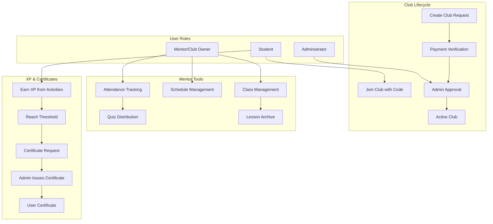

---

## Detailed Design

## Part 1: Bug Fixes

### Bug Fix 1: Course Lesson Video Visibility

#### Root Cause Analysis

Based on existing implementation in `app/admin/courses/new/[moduleId]/[lessonId]/page.tsx`, the video upload process:
- Stores video to local IndexedDB with `videoMediaId`
- Attempts auto-upload to server generating `videoUrl`
- Falls back to manual "Загрузить на сервер" button if auto-upload fails

Potential failure points:
- Video URL not persisted to database during lesson save
- URL path transformation inconsistency (local vs. server paths)
- Missing API endpoint in lesson update payload

#### Solution Design

**Backend Validation:**
- Ensure `PUT /api/admin-courses/lessons/:id` accepts and persists `videoUrl` field
- Validate that `GET /api/courses/:courseId` returns complete lesson data including `videoUrl`
- Confirm media serving endpoint `/api/media/:filename` serves videos with correct CORS and content-type headers

**Frontend Data Flow:**
- Admin uploads video → stores to IndexedDB → uploads to server → receives `videoUrl`
- `videoUrl` included in lesson update API call
- Student fetches course → receives lesson with `videoUrl` → video player renders with URL

**Verification Points:**

| Stage | Check | Expected Outcome |
|-------|-------|------------------|
| Admin Upload | videoUrl field populated | Non-empty string starting with `/api/media/` |
| Database Save | Lesson record contains videoUrl | Database query returns videoUrl |
| Student Fetch | API response includes videoUrl | JSON contains valid videoUrl |
| Video Render | HTML video element loads | Video playback without 404 |

---

### Bug Fix 2: ByteSize Video Publication

#### Root Cause Analysis

From `app/admin/bytesize/new/page.tsx`:
- Upload mechanism transforms URLs: `u.replace('/media/', '/api/media/')`
- Publication endpoint: `POST /api/admin/bytesize` with body `{ videoUrl, ... }`
- User fetch endpoint likely: `GET /api/bytesize`

Potential issues:
- URL normalization inconsistency between admin save and user fetch
- Missing publication status flag (e.g., `isPublished` field not set to true)
- Authorization check preventing public access

#### Solution Design

**URL Standardization:**
- Enforce single canonical format: `/api/media/:filename`
- Backend serving endpoint must handle both `/media/` and `/api/media/` paths
- Apply normalization at API boundary (server-side)

**Publication Workflow:**

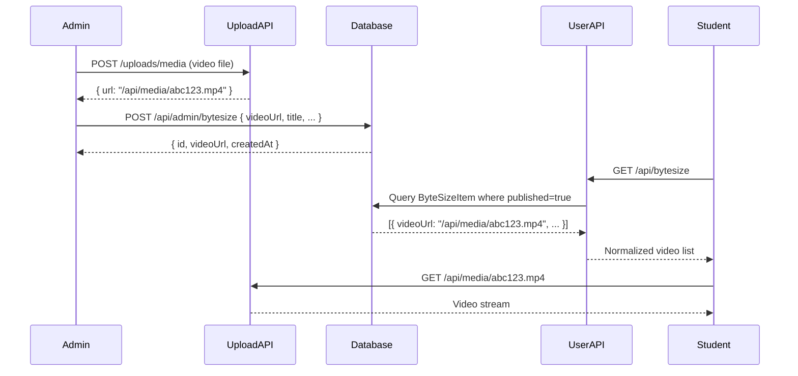

**Data Model Validation:**

| Field | Required | Default | Validation |
|-------|----------|---------|------------|
| videoUrl | Yes | - | Must start with `/api/media/` |
| title | Yes | - | Min 1 character |
| isPublished | No | true | Boolean |
| coverImageUrl | No | null | Optional image URL |

---

## Part 2: Club Creation and Subscription System

### Feature 1: Join Club vs. Create Club

#### User Interface Design

**Clubs Landing Page** (`/clubs` or dashboard clubs tab)

Layout structure:
- Hero section with two primary action buttons
- Club directory (list of joinable clubs)
- User's enrolled clubs section

**Primary Actions:**

| Action | Label | Behavior |
|--------|-------|----------|
| Join Club | "Вступить в кружок" | Opens modal requesting club access code |
| Create Club | "Открыть кружок" | Opens subscription payment modal |

**Join Club Flow:**

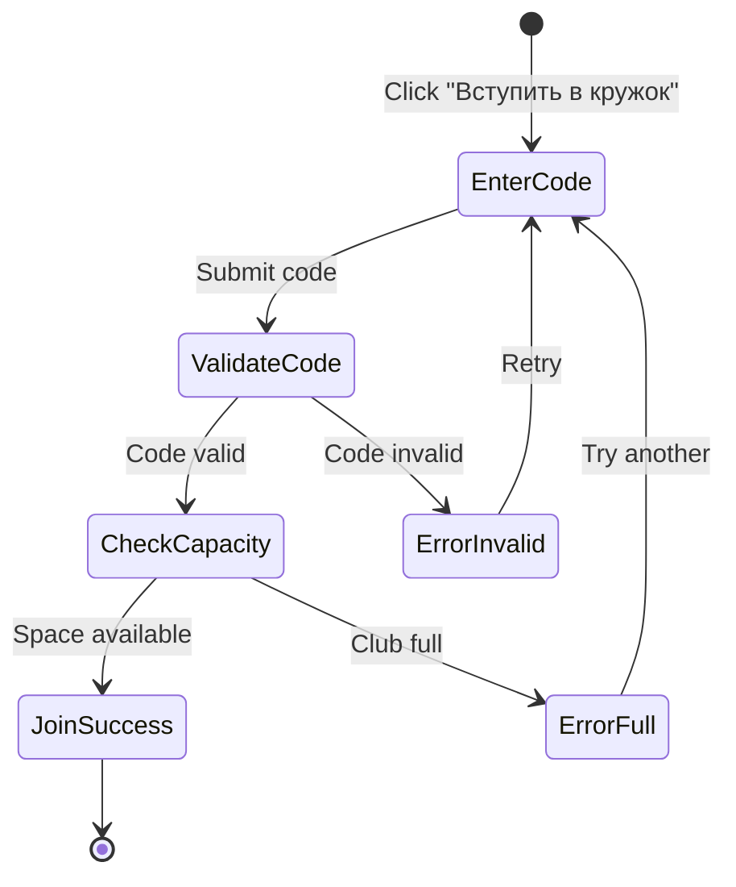

Modal elements:
- Input field: 6-digit numeric code
- Validation: real-time check against database
- Success action: redirect to club dashboard
- Error handling: display clear error message

---

### Feature 2: User Club Creation with Payment

#### Payment Verification Workflow

**Subscription Tiers:**

| Tier | Price | Max Classes | Max Students | Validity |
|------|-------|-------------|--------------|----------|
| One-time Purchase | 2000 KZT | 2 | 30 per class | 1 year |
| Monthly Subscription | X KZT/month | 2 | 30 per class | Recurring |

**Create Club Process:**

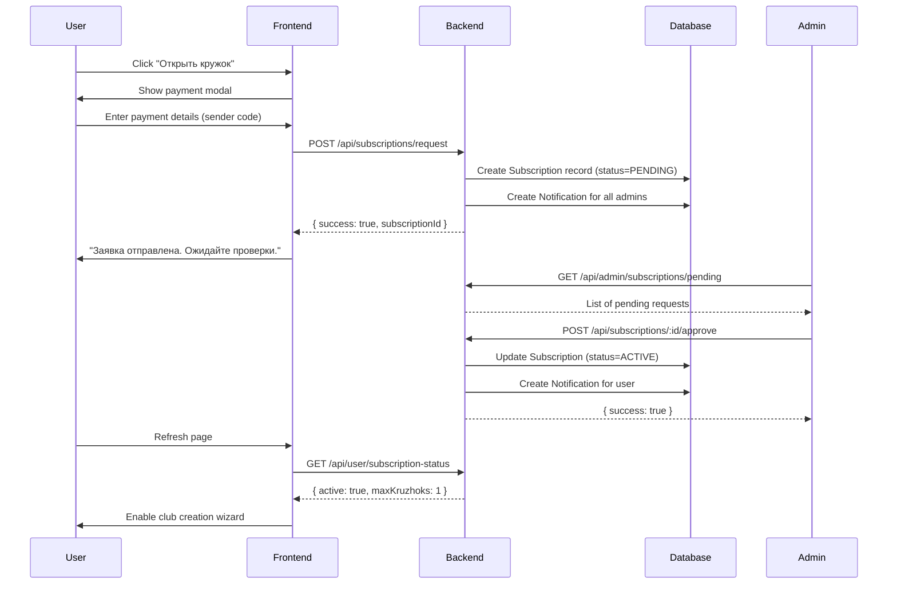

**Payment Modal UI Elements:**

| Element | Type | Content |
|---------|------|---------||
| Title | Text | "Открытие кружка" |
| Description | Paragraph | "Для открытия кружка оплатите 2000₸. Переведите сумму на указанный номер." |
| Payment Details | Info Box | Bank details, Kaspi number, reference code format |
| Input Field | Text | "Код отправителя" (4-8 digits from Kaspi transaction) |
| Action Button | Submit | "Отправить запрос" |
| Cancel Button | Secondary | "Отмена" |

**Backend Subscription Request Schema:**

| Field | Type | Required | Validation |
|-------|------|----------|------------|
| type | Enum | Yes | "ONETIME_PURCHASE" or "MONTHLY_SUBSCRIPTION" |
| paymentComment | String | Yes | Sender code from payment (unique) |
| paymentProofUrl | String | No | Optional screenshot URL |

---

### Feature 3: Admin Payment Approval Panel

#### Admin Interface Design

**Location:** `/admin/subscriptions` (existing page with tab enhancement)

**Tab Structure:**
- Tab 1: "Подписки" (Club subscription requests)
- Tab 2: "Сертификаты" (Certificate issuance)

**Subscription Request Card Layout:**

| Section | Data Displayed |
|---------|----------------|
| Header | User full name, email, request timestamp |
| Payment Info | Amount (2000 KZT), Payment comment/sender code, Type (one-time/monthly) |
| User Context | User ID, registration date, existing clubs count |
| Actions | Approve button (green), Reject button (red) |

**Approval Action:**
- API: `POST /api/subscriptions/:id/approve`
- Effect: Set subscription status to ACTIVE, set expiration date (+1 year), notify user
- User receives notification: "Подписка активирована. Теперь вы можете создавать кружки!"

**Rejection Action:**
- API: `POST /api/subscriptions/:id/reject`
- Require rejection reason (textarea input)
- Effect: Set status to REJECTED, notify user with reason
- User receives: "Оплата не подтверждена. Причина: [reason]. Свяжитесь с поддержкой."

---

### Feature 4: Mentor Access and Limits

#### Access Control Design

**Mentor Role Assignment:**
- Automatically granted upon subscription approval
- Does NOT change user.role field (remains USER)
- Tracked via active subscription relationship

**Permission Model:**

| Action | Permission Check |
|--------|------------------|
| Create Club | User has ACTIVE subscription with available club slots |
| Create Class | User owns club AND class count < subscription limit |
| Add Students | Class enrollment < subscription student limit |
| Edit Schedule | User is club owner or assigned mentor |

**Limit Enforcement:**

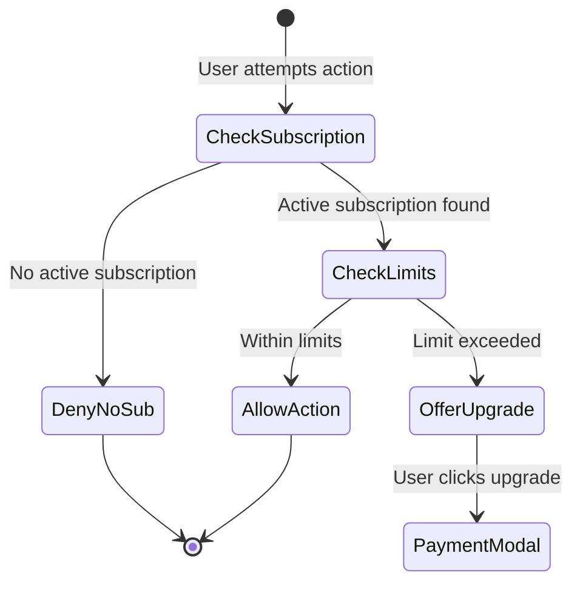

**Subscription Limits Data:**

| Field | Description | Default |
|-------|-------------|----------|
| maxKruzhoks | Maximum clubs user can create | 1 |
| maxClassesPerKruzhok | Maximum classes per club | 2 |
| maxStudentsPerClass | Maximum students per class | 30 |
| expiresAt | Subscription expiration date | +1 year from approval |

**Upgrade Modal Trigger:**
- Shown when user attempts to exceed any limit
- Message: "Вы достигли лимита [classes/students]. Обновите подписку для увеличения лимита."
- Action: Opens payment flow for additional capacity purchase

---

## Part 3: Modal Close Button Fix

### Consistency Requirements

All modal dialogs must implement uniform close behavior:

**Close Button Behaviors:**

| Trigger | Action | Data State |
|---------|--------|------------|
| Close button click | Close modal | Clear form inputs |
| Escape key press | Close modal | Clear form inputs |
| Backdrop click | Close modal | Clear form inputs |
| Successful submission | Close modal | Preserve data, redirect if needed |

**Implementation Pattern:**

Each modal component should:
- Manage open/closed state with boolean flag
- Reset all input fields when closing (unless explicitly saved)
- Use consistent close handler that:
  - Sets modal state to closed
  - Calls cleanup function to reset form state
  - Removes any temporary data from localStorage

**Affected Components:**
- Club creation modal
- Payment submission modal
- Join club modal
- Schedule creation modal
- Attendance marking modal
- Quiz assignment modal

**Testing Checklist:**

| Modal Type | Close Method | Expected State After Close |
|------------|--------------|---------------------------|
| Create Club | X button | Form cleared, modal hidden |
| | Escape key | Form cleared, modal hidden |
| | Backdrop click | Form cleared, modal hidden |
| Payment | Cancel button | Payment details cleared |
| Schedule | Close button | Temporary schedule data discarded |

---

## Part 4: XP and Certificate System

### XP Earning Mechanism

**XP Award Events:**

| Activity | XP Amount | Trigger |
|----------|-----------|---------||
| Correct quiz answer (course) | 20 | Answer submitted and marked correct |
| Lesson completion | 10 | Lesson progress set to 100% |
| Assignment submission | 50 | Assignment graded as passing |
| Attendance marked present | 100 | Mentor marks attendance for class session |
| Daily mission completion | Variable | Mission target reached |

**XP Accumulation:**
- XP is stored at user level: `User.experiencePoints` field
- Each XP-awarding action increments this field atomically
- Backend calculates threshold crossings after each increment

### Certificate Request System

#### Automated Request Generation

**Threshold Detection:**

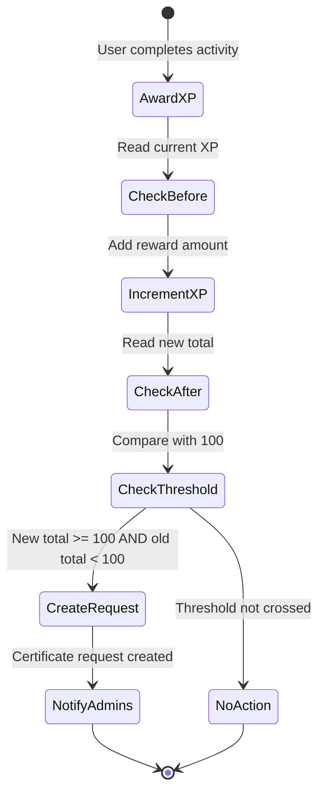

**Certificate Request Creation:**

When user crosses 100 XP threshold:
- Create `CertificateRequest` record with status PENDING
- Populate fields: userId, kruzhokId (if club activity), totalXP, thresholdXP, taskDescription
- Generate admin notifications for all admin users

**Admin Notification Content:**

| Field | Value |
|-------|-------|
| Title | "Новый запрос на сертификат" |
| Message | "Пользователь [Name] достиг [XP] XP и запросил сертификат" |
| Type | "CERTIFICATE_REQUEST" |
| Metadata | { certificateRequestId, userId, totalXP } |

---

### Admin Certificate Issuance

#### Admin Panel Interface

**Location:** `/admin/subscriptions?tab=certificates`

**Certificate Request List:**

Each pending request displays:
- Student name and email
- Total XP achieved
- Associated kruzhok/course title
- Task description (what they completed)
- Request timestamp
- Status badge (Pending/Sent/Denied)

**Issuance Flow:**

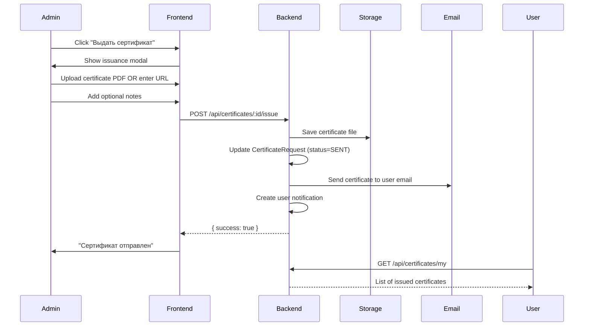

**Issuance Modal Fields:**

| Field | Type | Required | Description |
|-------|------|----------|-------------|
| Certificate URL | Text/File Upload | Yes | URL to certificate PDF or upload widget |
| Admin Notes | Textarea | No | Internal notes about issuance |
| Email to User | Checkbox | Yes (default checked) | Send notification email |

**Denial Flow:**

- Admin clicks "Отклонить"
- Modal requires denial reason (textarea)
- API: `POST /api/certificates/:id/deny { reason }`
- User receives notification: "Запрос на сертификат отклонен. Причина: [reason]"

**Certificate Data Model:**

| Field | Type | Description |
|-------|------|-------------|
| id | String | Unique identifier |
| userId | String | Reference to user |
| kruzhokId | String | Reference to club (nullable) |
| totalXP | Integer | XP at time of issuance |
| certificateUrl | String | Link to certificate file |
| status | Enum | PENDING / SENT / DENIED |
| issuedAt | DateTime | Timestamp of issuance |
| issuedById | String | Admin who issued |
| denialReason | String | Reason if denied (nullable) |

---

## Part 5: Schedule Management Separation

### Restructured Navigation

**Old Structure:**
- "Программы / Тесты" section contained schedule creation mixed with curriculum content

**New Structure:**

| Section | Purpose | Location |
|---------|---------|----------|
| Программы | Curriculum content, lesson materials, presentations, scenarios | Existing section |
| Тесты | Quiz management, question bank | Existing section |
| Расписание | Schedule creation, calendar view, lesson timing | NEW separate section |

**Schedule Section Features:**

- Calendar view with weekly/monthly toggle
- Create lesson session (date, time, class, program link)
- Edit existing sessions
- View upcoming lessons
- View past lessons (archived)
- Filter by class, date range, program

### Lesson Session Creation

**Schedule Entry Form:**

| Field | Type | Validation |
|-------|------|------------|
| Class | Dropdown | Select from mentor's classes |
| Program/Lesson | Dropdown | Select from available curriculum |
| Date | Date Picker | Cannot be in past |
| Start Time | Time Picker | Must be valid time |
| Duration | Number | 30-180 minutes |
| Location/Link | Text | Optional (for online link) |
| Notes | Textarea | Optional instructor notes |

**Calendar View:**

- Display lessons as cards on calendar grid
- Color-coded by class
- Click lesson card to view details or mark attendance
- Today's lesson highlighted

---

## Part 6: Today's Lesson and Lesson Page

### Today's Lesson Display

**Location:** Mentor dashboard, above class list

**Display Logic:**
- Query schedule for lessons where date = today AND mentor is owner
- Show most recent upcoming lesson (by start time)
- If multiple lessons today, show next chronological

**Card Contents:**

| Element | Data |
|---------|------|
| Time | "14:00 - 15:30" |
| Class Name | "Класс 7А" |
| Program Title | "Введение в робототехнику - Урок 3" |
| Action Button | "Начать урок" |

**Click Behavior:**
- Navigate to lesson session page: `/kruzhok/[klubId]/lesson/[sessionId]`

### Lesson Session Page

**Page Structure:**

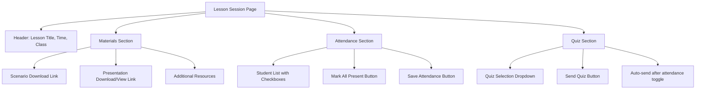

**Materials Section:**
- Downloads or opens in new tab
- Files linked from program curriculum

**Attendance Section:**
- See detailed design in Part 7

**Quiz Section:**
- After attendance marked, enable quiz distribution
- Auto-send option: automatically send quiz to students marked present
- Manual send: select quiz and manually trigger distribution

---

## Part 7: Attendance Tracking (Tabель)

### Interactive Attendance Table

**Table Structure:**

| Layout | Description |
|--------|-------------|
| Rows | One row per enrolled student |
| Columns | Student name + one column per lesson session |
| Cells | Checkbox or status indicator (present/absent/late/excused) |
| Actions Row | Add student, bulk mark, save, export |

**Cell States:**

| Status | Icon/Symbol | Color | XP Impact |
|--------|-------------|-------|----------|
| Present | ✓ | Green | +100 XP |
| Late | ⏰ | Yellow | +50 XP |
| Absent | ✗ | Red | 0 XP |
| Excused | ~ | Gray | 0 XP |

**Column Management:**
- Columns auto-created from schedule entries
- Can manually add column for ad-hoc sessions
- Column header shows date and lesson title

**Row Management:**
- Rows auto-populated from class enrollment
- "Добавить ученика" button opens student search/invite modal
- "Удалить" action next to each row (soft delete, preserves history)

**Save Behavior:**
- "Сохранить" button triggers batch update
- API call: `POST /api/kruzhok/[id]/attendance/batch`
- Payload: Array of { studentId, sessionId, status }
- Backend processes each attendance record:
  - Create or update Attendance record
  - Award XP if status = present or late
  - Create notification for student

**Summary Statistics:**

Display at bottom of table:
- Total sessions held
- Per-student attendance percentage
- Class average attendance

**Export Functionality:**
- Button: "Экспортировать"
- Format options: CSV, PDF
- Exports current filtered view of attendance table

---

## Part 8: Automated Quiz Distribution

### Quiz Assignment Workflow

**Trigger:** Mentor completes attendance marking for a lesson

**Process:**

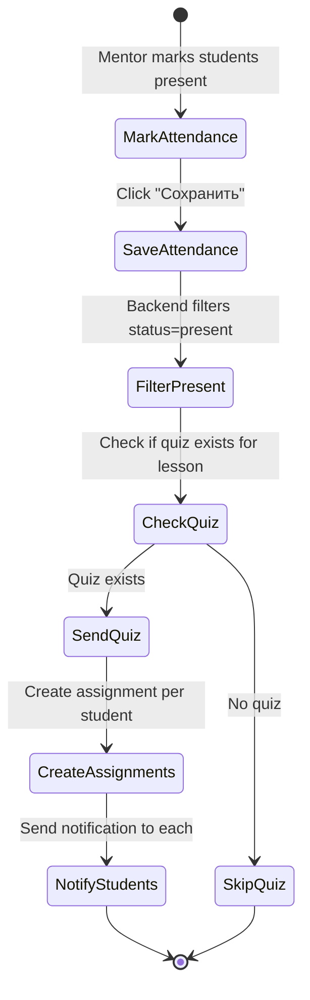

**Quiz Assignment Data:**

| Field | Value | Description |
|-------|-------|-------------|
| studentId | String | Reference to user |
| quizId | String | Reference to quiz from program |
| sessionId | String | Reference to lesson session |
| assignedAt | DateTime | Timestamp of assignment |
| dueAt | DateTime | Deadline (e.g., +24 hours) |
| status | Enum | ASSIGNED / SUBMITTED / GRADED |

**Student Notification:**
- Title: "Новый тест доступен"
- Message: "Пройдите тест по уроку '[Lesson Title]'. Срок: [Due Date]"
- Type: QUIZ_ASSIGNED
- Action Link: Direct link to quiz page

**Quiz Submission:**
- Student accesses quiz from notification or kruzhok dashboard
- Completes quiz (multiple choice, matching, etc.)
- Submits answers
- Backend auto-grades objective questions
- Mentor reviews and grades subjective questions
- XP awarded upon passing grade

---

## Part 9: Admin Panel Enhancements

### Consolidated Admin Functions

**Admin Panel Location:** `/admin/subscriptions`

**Tab 1: Подписки (Subscriptions)**

Displays:
- Pending subscription requests for club creation
- Request details: user info, payment comment, amount, type
- Actions: Approve, Reject

Functionality covered in Part 2, Feature 3.

**Tab 2: Сертификаты (Certificates)**

Displays:
- Pending certificate requests from users who reached XP thresholds
- Request details: student name, XP total, kruzhok, task description
- Actions: Issue certificate (with upload), Deny request

Functionality covered in Part 4.

**Existing Admin Sections:**

| Section | Purpose | Enhancements Needed |
|---------|---------|---------------------|
| Программы | Manage club curricula | Add presentation/scenario upload |
| Курсы | Manage courses | (no changes) |
| Платежи | Manage course payments | (no changes) |
| Пользователи | Manage users | (no changes) |

### Program Management Enhancements

**Add Lesson Materials:**

For each lesson in a program:
- Upload scenario (PDF/DOCX)
- Upload presentation (PDF/PPTX)
- Attach quiz from quiz bank
- Set XP reward for completion

**Material Storage:**
- Files uploaded to media storage via `/uploads/media`
- URLs stored in lesson record
- Mentor downloads materials from lesson session page

---

## Part 10: Lesson Archive and Reports

### Archive System Design

**Archived Data:**

For each completed lesson session, preserve:
- Lesson metadata (date, time, class, program, mentor)
- Attendance records (all student statuses)
- Quiz results (student submissions and scores)
- Materials used (scenario, presentation URLs)
- Mentor notes

**Storage:**
- All data persists in database (no deletion)
- Mark session as "completed" or "archived"
- Query archived sessions via filters

### Reporting Interface

**Location:** `/kruzhok/[id]/reports` or admin panel

**Filter Options:**

| Filter | Type | Options |
|--------|------|---------||
| Date Range | Date Picker | From - To dates |
| Class | Dropdown | Select class or "All" |
| Program | Dropdown | Select program or "All" |
| Student | Search | Filter by specific student |

**Report Views:**

**View 1: Lesson History**
- List of all sessions in reverse chronological order
- Columns: Date, Class, Program, Attendance Count, Quiz Avg Score
- Click row to expand details

**View 2: Student Progress**
- Per-student view showing:
  - Total attendance percentage
  - Average quiz score
  - Total XP earned in kruzhok
  - Recent activity timeline

**View 3: Quiz Analytics**
- Quiz performance across all sessions
- Columns: Quiz Title, Attempts, Avg Score, Pass Rate
- Identify difficult questions

**Export Functionality:**

| Format | Supported Views | Contents |
|--------|-----------------|----------|
| CSV | All views | Raw tabular data |
| PDF | Lesson History, Student Progress | Formatted report with charts |

**Export Triggers:**
- "Экспортировать CSV" button
- "Экспортировать PDF" button
- Backend generates file, returns download URL

---

## Data Model Summary

### New/Modified Database Entities

**Subscription** (existing, validate fields):

| Field | Type | Description |
|-------|------|-------------|
| id | String | Primary key |
| userId | String | Foreign key to User |
| type | Enum | ONETIME_PURCHASE / MONTHLY_SUBSCRIPTION |
| status | Enum | PENDING / ACTIVE / EXPIRED / REJECTED |
| amount | Decimal | Payment amount |
| currency | String | "KZT" |
| paymentMethod | String | "KASPI" |
| paymentComment | String | Unique sender code |
| maxKruzhoks | Integer | Default 1 |
| maxClassesPerKruzhok | Integer | Default 2 |
| maxStudentsPerClass | Integer | Default 30 |
| confirmedAt | DateTime | When admin approved |
| confirmedById | String | Admin who approved |
| expiresAt | DateTime | Expiration date |
| createdAt | DateTime | Request timestamp |

**CertificateRequest** (existing, validate fields):

| Field | Type | Description |
|-------|------|-------------|
| id | String | Primary key |
| userId | String | Foreign key to User |
| kruzhokId | String | Foreign key to Kruzhok (nullable) |
| totalXP | Integer | XP at time of request |
| thresholdXP | Integer | XP threshold crossed |
| taskDescription | String | What user completed |
| status | Enum | PENDING / SENT / DENIED |
| certificateUrl | String | Link to certificate file |
| issuedAt | DateTime | When admin issued |
| reviewedById | String | Admin who processed |
| denialReason | String | If denied |
| createdAt | DateTime | Auto-creation timestamp |

**Schedule** (new or validate existing):

| Field | Type | Description |
|-------|------|-------------|
| id | String | Primary key |
| classId | String | Foreign key to ClubClass |
| programLessonId | String | Link to curriculum lesson |
| scheduledDate | DateTime | Date and time of session |
| duration | Integer | Minutes |
| location | String | Physical location or online link |
| mentorNotes | String | Instructor preparation notes |
| status | Enum | SCHEDULED / COMPLETED / CANCELLED |
| createdById | String | Mentor who created |
| createdAt | DateTime | Creation timestamp |

**Attendance** (existing, validate fields):

| Field | Type | Description |
|-------|------|-------------|
| id | String | Primary key |
| sessionId | String | Foreign key to Schedule |
| studentId | String | Foreign key to User |
| status | Enum | present / absent / late / excused |
| xpAwarded | Integer | XP given for this attendance |
| markedAt | DateTime | When attendance recorded |
| markedById | String | Mentor who marked |

**ClubQuizAssignment** (new or validate existing):

| Field | Type | Description |
|-------|------|-------------|
| id | String | Primary key |
| studentId | String | Foreign key to User |
| quizId | String | Foreign key to quiz |
| sessionId | String | Foreign key to Schedule |
| assignedAt | DateTime | When assigned |
| dueAt | DateTime | Deadline |
| submittedAt | DateTime | When student submitted |
| score | Integer | Points earned |
| status | Enum | ASSIGNED / SUBMITTED / GRADED |

---

## API Endpoints Summary

### Video Bug Fixes

| Method | Endpoint | Purpose | Response |
|--------|----------|---------|----------|
| PUT | /api/admin-courses/lessons/:id | Update lesson (ensure videoUrl persisted) | Lesson object |
| GET | /api/courses/:courseId | Fetch course with videoUrl in lessons | Course with modules |
| GET | /api/bytesize | Fetch published ByteSize items | Array of items |
| POST | /api/admin/bytesize | Publish ByteSize item | Created item |

### Subscription & Payment

| Method | Endpoint | Purpose | Auth |
|--------|----------|---------|------|
| POST | /api/subscriptions/request | User submits subscription request | User |
| GET | /api/subscriptions/my | Get user's subscription status | User |
| GET | /api/admin/subscriptions/pending | List pending subscription requests | Admin |
| POST | /api/subscriptions/:id/approve | Approve subscription | Admin |
| POST | /api/subscriptions/:id/reject | Reject subscription | Admin |

### Certificates

| Method | Endpoint | Purpose | Auth |
|--------|----------|---------|------|
| GET | /api/certificates/my | User's issued certificates | User |
| GET | /api/certificates/pending | Pending certificate requests | Admin |
| POST | /api/certificates/:id/issue | Issue certificate to user | Admin |
| POST | /api/certificates/:id/deny | Deny certificate request | Admin |

### Schedule & Attendance

| Method | Endpoint | Purpose | Auth |
|--------|----------|---------|------|
| GET | /api/kruzhok/:id/schedule | Get club schedule | Mentor/Student |
| POST | /api/kruzhok/:id/schedule | Create lesson session | Mentor |
| PUT | /api/kruzhok/schedule/:sessionId | Update session | Mentor |
| POST | /api/kruzhok/:id/attendance/batch | Save batch attendance | Mentor |
| GET | /api/kruzhok/:id/attendance | Get attendance records | Mentor |

### Reports & Archive

| Method | Endpoint | Purpose | Auth |
|--------|----------|---------|------|
| GET | /api/kruzhok/:id/reports/lessons | Lesson history | Mentor/Admin |
| GET | /api/kruzhok/:id/reports/students | Student progress | Mentor/Admin |
| GET | /api/kruzhok/:id/reports/quizzes | Quiz analytics | Mentor/Admin |
| POST | /api/kruzhok/:id/reports/export | Export data to CSV/PDF | Mentor/Admin |

---

## User Flows

### Flow 1: Regular User Creates a Club

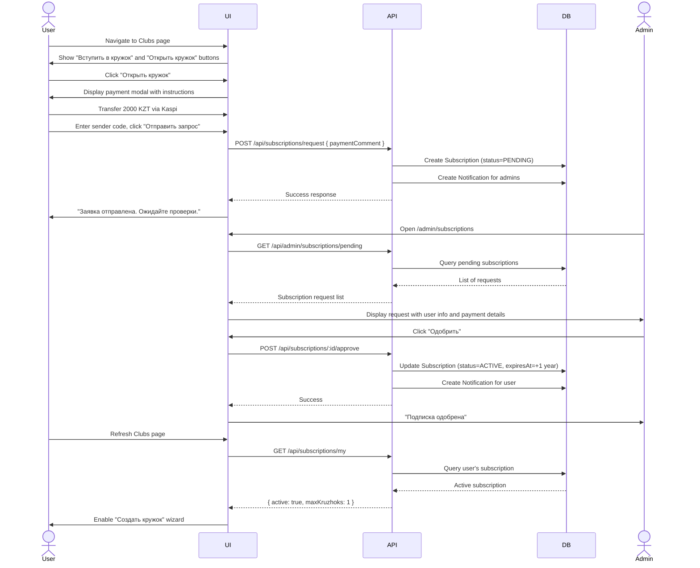

### Flow 2: Student Earns Certificate

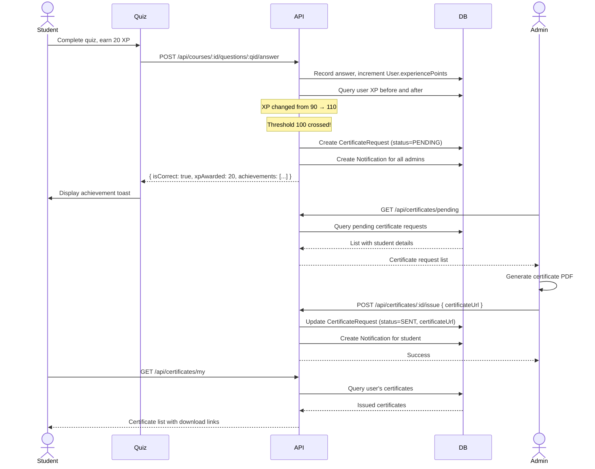

### Flow 3: Mentor Conducts Lesson with Quiz

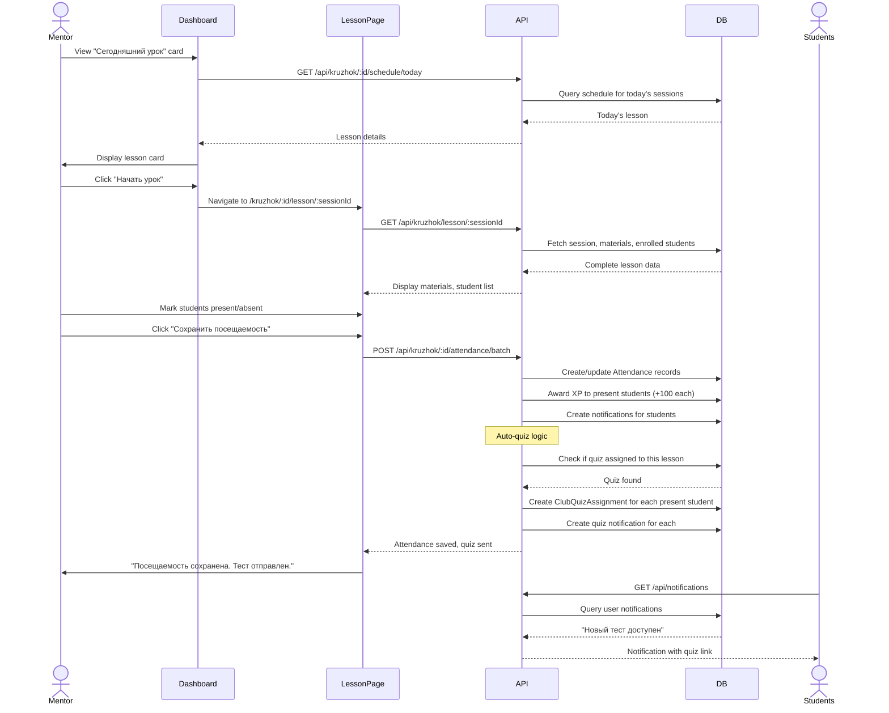

---

## UI/UX Specifications

### Clubs Page Redesign

**Hero Section:**
- Full-width banner with gradient background
- Heading: "Кружки S7 Robotics"
- Subheading: "Присоединяйтесь к существующим кружкам или создайте свой"

**Action Buttons:**
- Side-by-side layout on desktop, stacked on mobile
- Button 1: "Вступить в кружок" (Primary blue)
- Button 2: "Открыть кружок" (Secondary green)

**Club Directory:**
- Grid of club cards (3 columns desktop, 1 column mobile)
- Each card shows: Club title, member count, next session date, "Вступить" button

### Join Club Modal

**Layout:**
- Centered modal, max-width 400px
- Title: "Вступить в кружок"
- Input: 6-digit code (numeric only)
- Helper text: "Введите код доступа от ментора"
- Buttons: "Отмена" (secondary), "Вступить" (primary, disabled until 6 digits entered)

### Payment Modal

**Layout:**
- Centered modal, max-width 500px
- Title: "Открытие кружка"
- Informational section:
  - Icon: Kaspi logo
  - Text: "Переведите 2000₸ на номер: +7 XXX XXX XX XX"
  - Note: "В комментарии к платежу укажите ваш email"
- Input: "Код отправителя" (4-8 digits)
- Checkbox: "Я подтверждаю отправку платежа" (required)
- Buttons: "Отмена", "Отправить запрос" (disabled until checkbox + code)

### Attendance Table

**Desktop Layout:**
- Sticky header row with dates
- Sticky first column with student names
- Scrollable content area
- Cell hover highlights row and column

**Mobile Layout:**
- Accordion per student
- Expand to see all session statuses
- Quick toggle per session

**Color Scheme:**
- Present: #22c55e (green)
- Absent: #ef4444 (red)
- Late: #f59e0b (amber)
- Excused: #6b7280 (gray)

### Certificate Display

**User Profile Tab:**
- Section titled "Мои сертификаты"
- Grid of certificate cards
- Each card: Preview thumbnail, Course/Club name, Date issued, Download button

---

## Security Considerations

### Access Control

| Resource | Permission Required | Validation |
|----------|---------------------|------------|
| Create Club | Active subscription | Check subscription status and expiry |
| Approve Subscription | Admin role | Verify user.role === ADMIN |
| Issue Certificate | Admin role | Verify user.role === ADMIN |
| Mark Attendance | Club owner or mentor | Verify userId matches club.adminId or mentor assignment |
| View Attendance | Enrolled student or mentor | Check enrollment or ownership |
| Download Materials | Enrolled student or mentor | Verify access to club |

### Data Validation

**Subscription Request:**
- paymentComment must be unique (prevent duplicate submissions)
- Type must be valid enum value
- Amount must match expected value (server-side validation)

**Attendance:**
- sessionId must exist and belong to mentor's club
- studentId must be enrolled in class
- Status must be valid enum value

**Certificate Issuance:**
- certificateUrl must be valid URL or uploaded file
- Cannot issue certificate for already-issued request

### Rate Limiting

Apply rate limits to prevent abuse:

| Endpoint | Limit |
|----------|-------|
| POST /api/subscriptions/request | 3 requests per user per day |
| POST /api/kruzhok/:id/attendance/batch | 10 requests per mentor per hour |
| POST /api/certificates/:id/issue | 50 requests per admin per hour |

---

## Testing Strategy

### Bug Fix Verification

**Test 1: Course Video Visibility**
1. Admin uploads video to course lesson
2. Verify admin preview shows video
3. Publish course
4. Enroll as student
5. Navigate to lesson
6. **Expected:** Video plays without errors

**Test 2: ByteSize Video Publication**
1. Admin creates ByteSize item with video
2. Navigate to ByteSize feed as regular user
3. **Expected:** Newly uploaded video appears in feed
4. Click video
5. **Expected:** Video plays

### Feature Testing

**Test 3: Club Creation Flow**
1. Register as new user
2. Navigate to Clubs
3. Click "Открыть кружок"
4. Submit payment request with unique code
5. **Expected:** Success message, request appears in admin panel
6. Admin approves request
7. **Expected:** User receives notification, can now create club

**Test 4: Certificate Issuance**
1. Student earns 100 XP through quiz answers
2. **Expected:** Certificate request auto-created
3. Admin receives notification
4. Admin uploads certificate and issues
5. **Expected:** Student receives notification and certificate appears in profile

**Test 5: Attendance and Quiz**
1. Mentor creates lesson session
2. On lesson day, mark students present
3. **Expected:** XP awarded (+100 per student)
4. **Expected:** Quiz auto-sent to present students
5. Students receive quiz notification
6. Students submit quiz
7. **Expected:** Results visible in reports

---

## Deployment Plan

### Phase 1: Bug Fixes
- Fix course video URL persistence in lesson update API
- Fix ByteSize video URL normalization in fetch API
- Deploy backend changes
- Deploy frontend changes
- Verify with test uploads

### Phase 2: Subscription System
- Add database migrations for Subscription enhancements (if needed)
- Implement backend subscription endpoints
- Build frontend payment modal and admin approval UI
- Test subscription flow end-to-end
- Deploy and monitor

### Phase 3: Certificate System
- Ensure CertificateRequest model exists and is correct
- Implement auto-request creation on XP threshold
- Build admin certificate issuance UI
- Build user certificate display component
- Test certificate flow
- Deploy

### Phase 4: Schedule and Attendance
- Add Schedule entity if missing
- Implement schedule management UI
- Build attendance tracking table
- Implement batch attendance save
- Deploy and test with real class

### Phase 5: Quiz Automation
- Implement quiz assignment creation on attendance save
- Build student quiz notification and submission flow
- Test auto-distribution
- Deploy

### Phase 6: Reports and Archive
- Implement reporting queries
- Build report UI with filters
- Add CSV/PDF export functionality
- Deploy

---

## Command Reference for Deployment

The following commands should be executed on the production server after all code changes are committed and pushed to the main branch:

### Full Deployment (Frontend + Backend)

**Frontend Deployment:**
```
cd /var/www/s7
git fetch origin
git reset --hard origin/main
npm ci
npm run build
pm2 restart s7-frontend
```

**Backend Deployment:**
```
cd /var/www/s7/server
npm ci
npx prisma format --schema ../prisma/schema.prisma
npx prisma generate --schema ../prisma/schema.prisma
npx prisma db push --schema ../prisma/schema.prisma
npm run build
pm2 restart s7-backend
```

### Backend-Only Deployment

```
cd /var/www/s7
git fetch origin
git reset --hard origin/main
cd server
npm ci
npx prisma format --schema ../prisma/schema.prisma
npx prisma generate --schema ../prisma/schema.prisma
npx prisma db push --schema ../prisma/schema.prisma
npm run build
pm2 restart s7-backend
pm2 logs s7-backend --lines 50
```

### Database Migration Only

```
cd /var/www/s7/server
npx prisma format --schema ../prisma/schema.prisma
npx prisma generate --schema ../prisma/schema.prisma
npx prisma db push --schema ../prisma/schema.prisma
```

### Verification Commands

**Check service status:**
```
pm2 status
```

**View backend logs:**
```
pm2 logs s7-backend --lines 100
```

**View frontend logs:**
```
pm2 logs s7-frontend --lines 100
```

**Restart all services:**
```
pm2 restart all
```

---

## Success Criteria

### Bug Fixes
- [ ] Course lesson videos display correctly for enrolled students
- [ ] ByteSize videos appear in public feed after admin upload
- [ ] Video playback works without 404 errors

### Club Creation
- [ ] Regular users can submit club creation requests
- [ ] Payment modal displays correct instructions
- [ ] Admin panel shows pending subscription requests
- [ ] Admin can approve/reject requests with notifications
- [ ] Approved users can create clubs within subscription limits

### Mentor Tools
- [ ] Mentor dashboard shows today's lesson
- [ ] Lesson session page displays materials and attendance table
- [ ] Attendance marking awards XP correctly
- [ ] Attendance table allows bulk editing and saving
- [ ] Schedule section exists separately from program management

### Certificates
- [ ] Certificate requests auto-created at 100 XP threshold
- [ ] Admin receives notification of new requests
- [ ] Admin can issue certificates with file upload
- [ ] Students can view and download certificates from profile

### Quiz Automation
- [ ] Quizzes auto-sent to students marked present
- [ ] Students receive quiz notifications
- [ ] Quiz results stored and visible in reports

### Reports
- [ ] Lesson history report displays archived sessions
- [ ] Student progress report shows attendance and XP
- [ ] Export to CSV and PDF functions work
- [ ] Filters apply correctly (date range, class, student)

### Modal Behavior
- [ ] All modals close properly via X button, Escape key, and backdrop click
- [ ] Form data clears on modal close
- [ ] No state persistence after modal close (unless explicitly saved)

---

## Risk Assessment

| Risk | Impact | Mitigation |
|------|--------|------------|
| Payment verification abuse | High | Implement unique payment code validation, rate limiting on submission |
| XP manipulation | Medium | Server-side XP calculation only, validate all XP-awarding actions |
| Database performance with large attendance tables | Medium | Index sessionId, studentId, classId; implement pagination |
| File storage overflow from certificate uploads | Low | Limit file sizes, implement storage quotas, compress PDFs |
| Subscription expiry not enforced | High | Background job to check expiresAt and disable expired subscriptions |

---

## Future Enhancements

### Potential Additions

1. **Automated Payment Integration:**
   - Direct Kaspi API integration for automatic payment verification
   - Instant subscription activation without admin approval

2. **Advanced Analytics:**
   - Predictive analytics for student drop-off risk
   - Performance trends over time
   - Comparison across multiple classes

3. **Mobile App:**
   - Native iOS/Android apps for mentors and students
   - Push notifications for quiz assignments and certificates

4. **Video Conferencing Integration:**
   - Embed Zoom/Google Meet directly in lesson page
   - Auto-record sessions and archive

5. **Gamification:**
   - Leaderboards per club
   - Badges for milestone achievements
   - Streak tracking for consistent attendance

---

## Conclusion

This design provides a comprehensive blueprint for fixing critical video display bugs and implementing a full-featured club management system with user-driven creation, mentor tools, XP-based certificates, and robust reporting. The phased deployment approach ensures systematic rollout with testing at each stage. Success criteria are clearly defined, and command references are provided for production deployment.

**Key Outcomes:**
- **Bug Resolution:** Course and ByteSize videos will display reliably
- **User Empowerment:** Regular users can create and manage clubs
- **Operational Excellence:** Mentors gain tools for efficient class management
- **Quality Assurance:** Automated certificate system recognizes student achievement
- **Data Insights:** Comprehensive reporting enables data-driven decisions

The design maintains compatibility with existing systems while introducing substantial new functionality aligned with business requirements.
